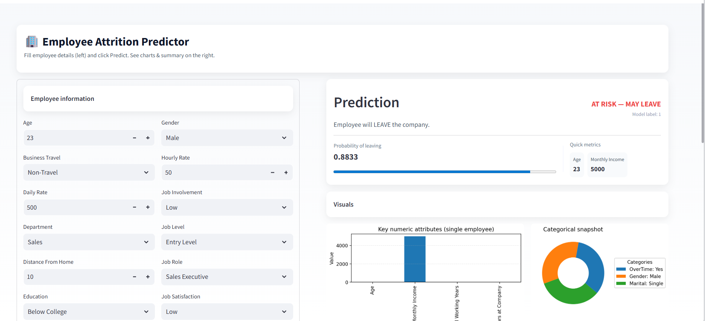

<p align="center">
  
</p>

<p align="center">
  
  
  
  
  
</p>

#  Employee Attrition Prediction  End-to-End ML Project

A complete end-to-end Machine Learning project for predicting **Employee Attrition** using HR data.

The project includes:

- Data preprocessing
- Model training using XGBoost
- Model serialization
- FastAPI backend
- Streamlit frontend
- Docker support

---

#  1. Project Structure

```text
project/
│
├── Dockerfile
├── README.md
├── main.py
├── predict.py
├── Streamlit.py
├── train.py
│
├── images/
│   ├── Project_Overview.png
│
└── model/
    ├── employee_attrition_model.bin
    ├── employee_dict_vectorizer.bin
    └── preprocessed_data.csv
````

## Folder Description

| Folder / File  | Description                                              |
| -------------- | -------------------------------------------------------- |
| `train.py`     | Trains the ML model and saves artifacts                  |
| `predict.py`   | FastAPI prediction logic                                 |
| `main.py`      | Main FastAPI entry point                                 |
| `Streamlit.py` | Streamlit user interface                                 |
| `model/`       | Stores the trained model, vectorizer, and processed data |
| `images/`      | Stores project screenshots and visual assets             |
| `Dockerfile`   | Docker configuration for deployment                      |
| `README.md`    | Project documentation                                    |

---

#  2. Problem Description

Employee attrition prediction helps HR teams identify employees who may leave the company.

The goal is to predict whether an employee will leave based on HR-related features such as:

* Age
* Business Travel
* Department
* Job Role
* Monthly Income
* Overtime
* Work-Life Balance
* Job Satisfaction
* Years at Company
* Years with Current Manager

This helps companies improve employee retention, reduce hiring costs, and understand risk factors behind employee turnover.

---

#  3. Dataset

The project uses the IBM HR Employee Attrition dataset:

```text
../data/WA_Fn-UseC_-HR-Employee-Attrition.csv
```

During training, the dataset is cleaned and saved as:

```text
model/preprocessed_data.csv
```

---

# 4. Data Preprocessing

The preprocessing pipeline is implemented in `train.py`.

Main preprocessing steps:

* Fill missing values
* Normalize column names to lowercase
* Remove duplicate rows
* Convert target column `Attrition` into binary values:

  * `Yes` → `1`
  * `No` → `0`
* Drop unnecessary columns:

  * `EmployeeCount`
  * `StandardHours`
  * `Over18`
  * `EmployeeNumber`
* Convert encoded categorical values into readable labels:

  * Education
  * Environment Satisfaction
  * Job Involvement
  * Job Level
  * Job Satisfaction
  * Performance Rating
  * Relationship Satisfaction
  * Work-Life Balance

---

#  5. Model Training

The model training pipeline is implemented in:

```text
train.py
```

The project uses:

```text
XGBoost Classifier
```

The model is trained using the following main configuration:

```python
XGBClassifier(
    learning_rate=0.05,
    max_depth=4,
    n_estimators=200,
    objective="binary:logistic",
    eval_metric="logloss",
    random_state=42,
    subsample=0.8,
    colsample_bytree=0.8,
)
```

---

#  6. Feature Vectorization

The project uses:

```python
DictVectorizer
```

The input employee data is converted into dictionaries, then transformed into numerical features suitable for the ML model.

The vectorizer is saved inside:

```text
model/employee_dict_vectorizer.bin
```

---

#  7. Saved Model Artifacts

After running `train.py`, the project stores all generated model files inside the `model/` folder.

```text
model/
├── employee_attrition_model.bin
├── employee_dict_vectorizer.bin
└── preprocessed_data.csv
```

| File                           | Description                         |
| ------------------------------ | ----------------------------------- |
| `employee_attrition_model.bin` | Trained XGBoost model               |
| `employee_dict_vectorizer.bin` | DictVectorizer used during training |
| `preprocessed_data.csv`        | Cleaned dataset after preprocessing |

---

#  8. Evaluation Metrics

The model is evaluated using:

* Confusion Matrix
* Accuracy Score
* Classification Report
* ROC-AUC Score

The evaluation is printed directly in the terminal after training.

Example:

```bash
python train.py
```

Output includes:

```text
TRAINING RESULTS
TESTING RESULTS
ROC AUC SCORE
```

---

#  9. FastAPI Backend

The backend API is implemented using FastAPI.

Main file:

```text
predict.py
```

The API loads the saved model and vectorizer from:

```text
model/employee_attrition_model.bin
model/employee_dict_vectorizer.bin
```

## Run FastAPI

```bash
uvicorn predict:app 
```

Use the command that matches your final API entry file.

After running the API, open:

```text
http://127.0.0.1:8000/docs
```

---

#  10. API Endpoints

## Health Check

```http
GET /
```

Returns a simple message confirming that the API is running.

## Prediction Endpoint

```http
POST /predict
```

Receives employee data and returns:

```json
{
  "prediction": 0,
  "probability_of_leaving": 0.1234,
  "message": "Employee will NOT leave the company."
}
```

Prediction labels:

| Label | Meaning                 |
| ----- | ----------------------- |
| `0`   | Employee will not leave |
| `1`   | Employee may leave      |

---

#  11. Streamlit Frontend

The frontend interface is implemented in:

```text
Streamlit.py
```

It allows users to:

* Enter employee information
* Send data to the FastAPI backend
* Display prediction result
* Show probability of leaving
* Visualize key employee attributes

## Run Streamlit

```bash
streamlit run Streamlit.py
```

Make sure the FastAPI backend is running before using the Streamlit interface.

---

#  12. Images Folder

All screenshots and visual assets should be stored inside:

```text
images/
```

Example usage inside Markdown:

```markdown
.png" width="800">
```

This keeps the project clean and avoids placing screenshots directly in the root folder.

---

#  13. Environment Setup

## Using venv

```bash
python -m venv .venv
```

Activate on Windows:

```bash
.venv\Scripts\activate
```

Install dependencies:

```bash
pip install -r requirements.txt
```

---

#  14. Environment Setup Using UV

If you are using `uv`, run:

```bash
uv venv
```

Activate on Windows:

```bash
.venv\Scripts\activate
```

Install requirements:

```bash
uv pip install -r requirements.txt
```

Run training:

```bash
uv run train.py
```

Run FastAPI:

```bash
uv run uvicorn predict:app --reload
```

Run Streamlit:

```bash
uv run streamlit run Streamlit.py
```

---

# 🐳 15. Docker

The project includes a Dockerfile.

## Build Docker Image

```bash
 docker build -t employee-attrition-api .
```

## Run Docker Container

```bash
docker run -p 8000:8000 employee-attrition-api
```

Then open:

```text
http://127.0.0.1:8000/docs
```

---

#  16. How to Run the Full Project

## Step 1: Train the Model

```bash
python train.py
```

This will create:

```text
model/employee_attrition_model.bin
model/employee_dict_vectorizer.bin
model/preprocessed_data.csv
```

## Step 2: Start FastAPI Backend

```bash
uvicorn predict:app --reload
```

or:

uvicorn predict:app --reload
```

## Step 3: Start Streamlit Frontend

Open a new terminal and run:

```bash
streamlit run Streamlit.py
```

---

#  17. Example Prediction Request

Example JSON body for `/predict`:

```json
{
  "age": 30,
  "businesstravel": "Travel_Rarely",
  "dailyrate": 500,
  "department": "Sales",
  "distancefromhome": 10,
  "education": "Bachelor",
  "educationfield": "Life Sciences",
  "environmentsatisfaction": "High",
  "gender": "Male",
  "hourlyrate": 50,
  "jobinvolvement": "High",
  "joblevel": "Mid Level",
  "jobrole": "Sales Executive",
  "jobsatisfaction": "High",
  "maritalstatus": "Single",
  "monthlyincome": 5000,
  "monthlyrate": 15000,
  "numcompaniesworked": 1,
  "overtime": "Yes",
  "percentsalaryhike": 11,
  "performancerating": "Excellent",
  "relationshipsatisfaction": "High",
  "stockoptionlevel": 0,
  "totalworkingyears": 5,
  "trainingtimeslastyear": 2,
  "worklifebalance": "Better",
  "yearsatcompany": 2,
  "yearsincurrentrole": 1,
  "yearssincelastpromotion": 0,
  "yearswithcurrmanager": 1
}
```


#  19. Final Notes

* The project is now organized with a clean folder structure.
* Model files are stored inside `model/`.
* Screenshots and UI images are stored inside `images/`.
* FastAPI is used for backend prediction.
* Streamlit is used for the frontend interface.
* XGBoost is used as the deployed machine learning model.

---

#  Project Status

The project is ready for local training, API testing, UI usage, and Docker deployment.

