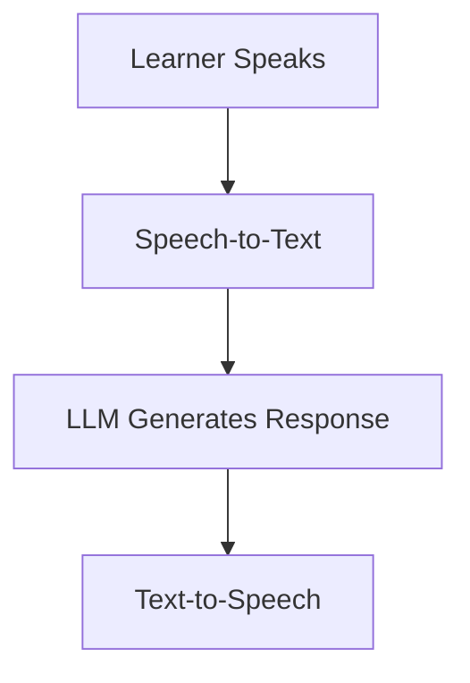
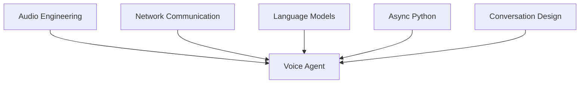
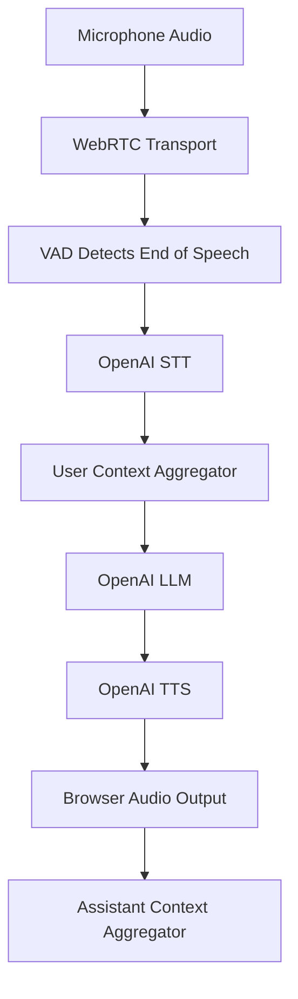
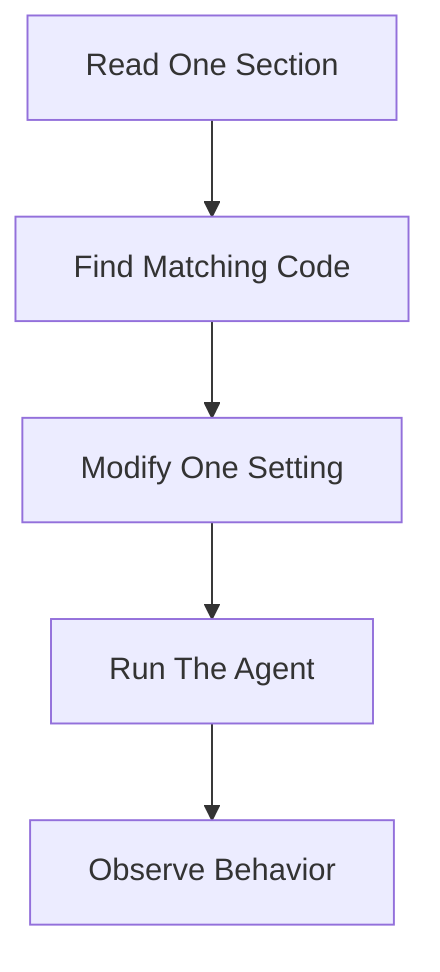
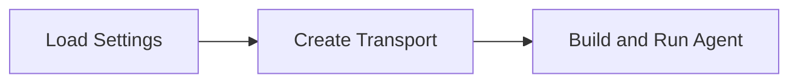

# Concept Overview

> [!info]
> This report explains the minimum set of concepts required to understand the English Voice Coach project in this repository.
```
"C:\Users\ibrah\Desktop\codex\english_t"
```
The project is a real-time voice agent that follows a simple processing flow:




## Technologies Used

The implementation uses:

- Python for application logic
- Pipecat for the real-time voice pipeline
- OpenAI Speech-to-Text (STT)
- OpenAI Large Language Model (LLM)
- OpenAI Text-to-Speech (TTS)
- WebRTC for browser audio communication

## Purpose of This Guide

This report is organized as a guided code reading.

It does **not** attempt to cover every Pipecat feature.

Instead, it focuses on the concepts required to:

- Run the project
- Explain the architecture
- Modify components
- Extend functionality
- Build more advanced voice agents

# Why It Matters

Voice agents combine multiple disciplines that are often learned separately:



Without a clear mental model, the application can appear as one large block of AI magic.

The goal of these notes is to break the system into understandable components.

> [!tip]
> A voice agent is a **pipeline of transformations**, not a single AI model.

---

# Voice Agent Architecture

Each component has one primary responsibility.

| Component | Input | Output | Responsibility |
|------------|---------|----------|----------------|
| Browser Transport | Human Voice | Audio Frames | Capture audio |
| STT | Audio | Text | Speech transcription |
| Context Aggregator | Text Messages | Conversation History | Preserve memory |
| LLM | Conversation History | Response Text | Generate coaching response |
| TTS | Response Text | Audio | Convert text to speech |
| Browser Transport | Audio Frames | Sound | Play audio |

---

# Project Structure

```text
voice_agent_first/
│
├── main.py
│   ├── Create transport
│   ├── Create STT, LLM, TTS services
│   ├── Create conversation context
│   ├── Define Pipecat pipeline
│   └── Handle connect/disconnect events
│
├── config.py
│   ├── Load .env
│   ├── Validate OPENAI_API_KEY
│   └── Store application settings
│
├── prompts.py
│   ├── Coach behavior
│   └── Greeting instructions
│
├── .env.example
│
└── requirements.txt
```

---

# The Core Pipeline

The most important code block in the entire project is:

```python
pipeline = Pipeline(
    [
        transport.input(),
        stt,
        user_aggregator,
        llm,
        tts,
        transport.output(),
        assistant_aggregator,
    ]
)
```

Understanding this pipeline means understanding the whole application.

---

# End-to-End Interaction Flow

Suppose the learner says:

```text
I go yesterday to market.
```

The request moves through the pipeline as follows:



### Example

**User:**

```text
I go yesterday to market.
```

**STT Output:**

```text
I go yesterday to market.
```

**LLM Response:**

```text
Good try!

A more natural sentence is:

I went to the market yesterday.
```

**TTS Output:**

Audio spoken back to the learner.

---

# Learning Path

Read the chapters in the following order:

1. Voice Agent Fundamentals
2. Pipecat Core Concepts
3. Pipelines and Frames
4. STT, LLM, and TTS
5. Context and Memory
6. WebRTC and Transports
7. Building the English Coach
8. Production Best Practices
9. Next Steps
10. Glossary

---

# Recommended Learning Workflow



> [!warning]
> Change only one component at a time.
>
> If you modify the prompt, STT model, TTS voice, and pipeline order simultaneously, it becomes difficult to understand the cause of behavior changes.

---

# Running the Baseline Project

## Create a Virtual Environment

```powershell
python -m venv .venv
.\.venv\Scripts\Activate.ps1
```

## Install Dependencies

```powershell
pip install -r requirements.txt
```

## Create Environment File

```powershell
Copy-Item .env.example .env
```

Add a valid OpenAI API key.

## Start the Agent

```powershell
python main.py -t webrtc
```

Open:

```text
http://localhost:7860/client
```

> [!tip]
> Use headphones whenever possible to avoid microphone echo and audio feedback loops.

---

# Pipecat Entry Point

Pipecat starts each session using:

```python
async def bot(runner_args: RunnerArguments) -> None:
    config = AppConfig.from_env()
    transport = await create_transport(
        runner_args,
        TRANSPORT_PARAMS
    )

    await run_voice_coach(
        transport,
        runner_args,
        config
    )
```

The responsibilities are clearly separated:



---

# Common Mistakes

## Treating the LLM as the Entire Voice Agent

The LLM only processes text.

It does **not**:

- Capture microphone audio
- Detect speech boundaries
- Maintain network connections
- Play audio responses

---

## Ignoring Latency

Voice systems are sensitive to delays.

Every stage contributes to response time:

- Audio capture
- STT
- LLM
- TTS
- Network transport

---

## Assuming STT Is Perfect

Speech recognition is probabilistic.

Results may vary due to:

- Noise
- Accents
- Microphone quality
- Domain-specific vocabulary

---

## Assuming Pronunciation Analysis From Text

The LLM receives only the transcript.

It does not have enough phonetic information to perform detailed pronunciation assessment.

---

## Reading Without Running

Voice systems are best understood through experimentation.

Run the project before making modifications.

---

# Key Takeaways

> [!summary]

- A voice agent is a sequence of specialized components.
- Pipecat coordinates these components.
- `main.py` contains the runtime architecture.
- `config.py` manages configuration.
- `prompts.py` defines coaching behavior.
- The pipeline is the central architectural element.
- Learn by changing one component at a time.