> [!info]  
> This chapter explains the core ideas behind voice agents and how they differ from normal text chatbots.


## Concept Overview

A **voice agent** is software that participates in a spoken conversation.

It must:

- Listen
    
- Understand
    
- Decide what to say
    
- Speak
    
- Repeat the process
    

The simplest useful model is:

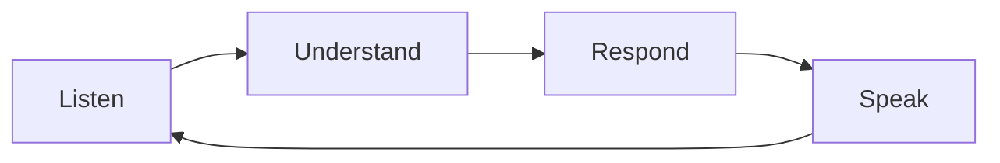

In this project:

|Stage|Implementation|
|---|---|
|Listen|Browser microphone + WebRTC|
|Understand|OpenAI STT + conversation context|
|Respond|OpenAI LLM + English coach prompt|
|Speak|OpenAI TTS + browser speakers|


## Why Voice Agents Are Different

A voice agent is different from a command-line chatbot because audio is continuous.

In text chat, the user clearly sends a message:

```text
user types -> presses Enter -> model responds
```

In voice, there is no Enter key:

```text
audio audio audio silence audio noise ...
```

The system must decide:

- When did the learner start speaking?
    
- When did the learner stop?
    
- Is the transcript complete?
    
- Should the coach start talking?
    
- What happens if the learner interrupts?
    
- When should the session end?
    

> [!warning]  
> These timing questions are part of the voice agent itself. They are not optional implementation details.


## From Continuous Audio to User Turns

Voice agents must convert continuous microphone input into conversation turns.

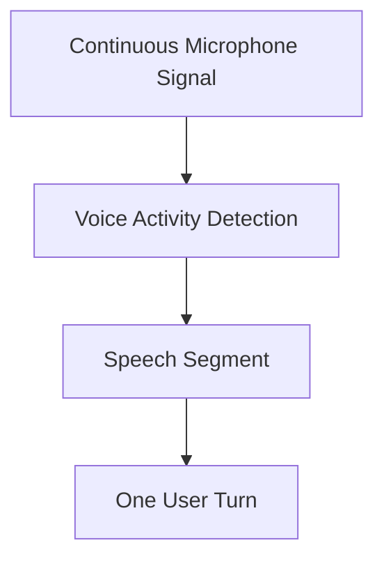

If turn detection is poor, even a strong LLM may produce a bad experience.

The agent may:

- Answer too early
    
- Wait too long
    
- Transcribe incomplete sentences
    
- Interrupt the learner unnaturally
## The Voice Conversation Loop

One learner turn passes through several states:

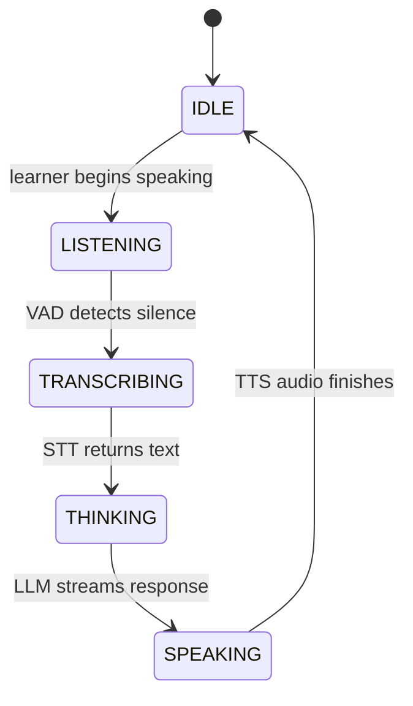

Real production agents may allow interruption during `SPEAKING`.

This tutorial keeps the design simple, but Pipecat still manages the real-time frame flow required for natural interaction.

# Chained and Speech-to-Speech Architectures

## Chained Architecture

The English Voice Coach uses a chained architecture:

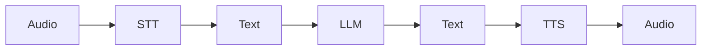

### Advantages

- Each stage is visible
    
- Transcripts can be inspected
    
- Models can be replaced independently
    
- Prompting is straightforward
    
- Text can be logged for education and debugging
    

### Costs

- More network calls
    
- More total latency
    
- Vocal details may be lost during transcription
    

> [!tip]  
> For this course project, the chained architecture is the better teaching tool because every stage is easy to inspect and explain.


## Speech-to-Speech Architecture

A speech-to-speech model uses audio directly:

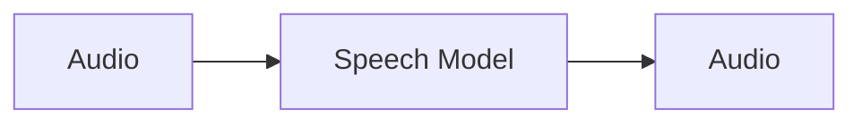

### Advantages

- Potentially lower latency
    
- Better access to tone and speaking style
    
- Simpler-looking pipeline
    

### Costs

- Internal decisions are less visible
    
- Text-based auditing can be harder
    
- Model behavior and audio behavior are tightly coupled
    


# Latency: The Hidden Quality Requirement

Voice agents are very sensitive to delay.

The total response delay is approximately:

```text
total latency =
turn detection delay
+ STT delay
+ LLM first-token delay
+ TTS first-audio delay
+ network and buffering delay
```

Example:

|Stage|Approximate Delay|
|---|--:|
|VAD waits for silence|500 ms|
|STT request|1000 ms|
|LLM begins responding|600 ms|
|TTS begins producing audio|500 ms|
|Network / buffering|200 ms|
|**First audible response**|**2800 ms**|

> [!note]  
> These values are illustrative. The important idea is that small delays add up.

The project enables metrics with:

```python
params = PipelineParams(
    audio_out_sample_rate=24000,
    enable_metrics=True,
    enable_usage_metrics=True,
)
```

Metrics turn latency from a vague feeling into a measurable engineering problem.

# Turn-Taking and VAD

**VAD** means **Voice Activity Detection**.

A VAD analyzer distinguishes likely speech from silence or background noise.

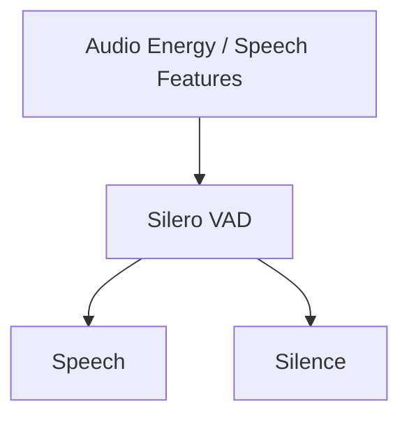

The project configures VAD here:

```python
user_aggregator, assistant_aggregator = LLMContextAggregatorPair(
    context,
    user_params=LLMUserAggregatorParams(
        vad_analyzer=SileroVADAnalyzer(),
    ),
)
```

> [!important]  
> VAD does not understand sentence meaning.
> 
> It only estimates whether the audio contains speech.

A learner who pauses to think may be mistaken for someone who finished speaking.


# Streaming

Streaming means processing partial output as it becomes available instead of waiting for the entire result.

## Without Streaming

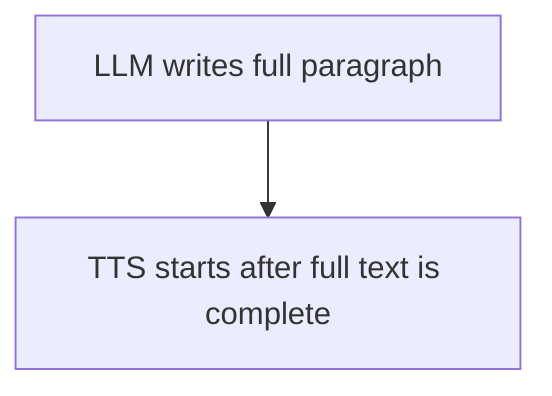

## With Streaming

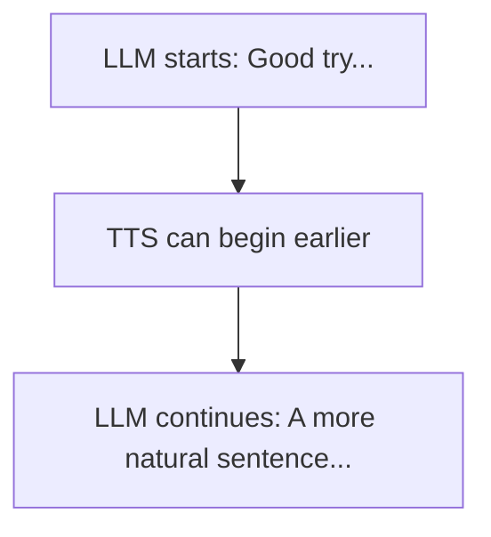

Streaming lowers perceived latency.

The learner hears the beginning of the answer while later text is still being generated.


# Conversation Quality Is More Than Model Quality

A good voice experience depends on several layers:

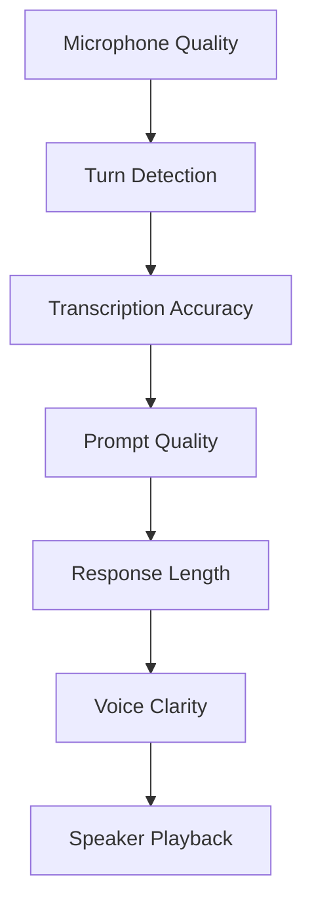

> [!warning]  
> A larger LLM cannot repair every failure below it.
> 
> If STT transcribes the wrong sentence, the LLM may confidently correct a mistake the learner never made.


# Practical Example: Trace One Turn

Learner audio:

```text
Yesterday I am visit my friend.
```

Possible processing:

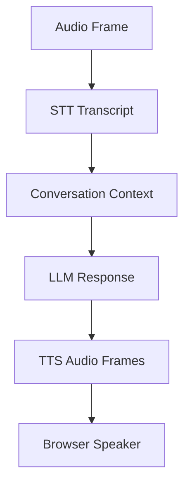

## STT Transcript

```text
Yesterday I am visit my friend.
```

## Context

```text
user: Yesterday I am visit my friend.
```

## LLM Response

```text
Good try! A natural sentence is:

Yesterday I visited my friend.

We use visited for a finished past action.

What did you do together?
```

## Debugging Rule

To debug a wrong response, ask:

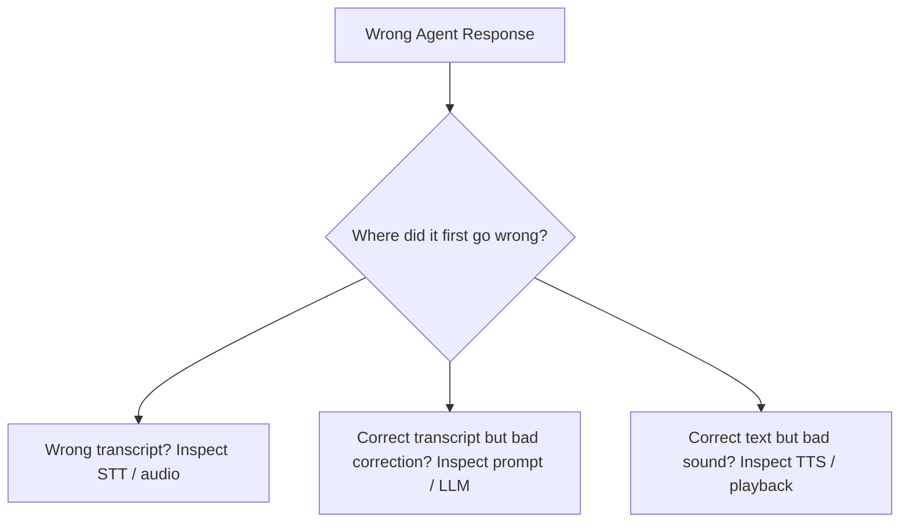
# Relevant Pipecat Code

The architecture is declared directly in the pipeline:

```python
pipeline = Pipeline(
    [
        transport.input(),
        stt,
        user_aggregator,
        llm,
        tts,
        transport.output(),
        assistant_aggregator,
    ]
)
```

## Audio-Facing Processors

```python
transport.input()
transport.output()
```

## Intelligence Stages

```python
stt
llm
tts
```

## Memory Stages

```python
user_aggregator
assistant_aggregator
```

This separation makes the system easier to reason about.

# Common Mistakes

## Waiting for Perfect Silence

Real rooms contain:

- Fans
    
- Keyboard noise
    
- Echo
    
- Background voices
    

Turn detection must tolerate imperfect audio.


## Producing Long Spoken Answers

A five-paragraph text answer may be readable, but it is exhausting when spoken.

Voice responses should usually be short.

## Correcting Every Small Issue

Too many corrections make the conversation feel like an exam.

The coach should usually provide:

- One important correction
    
- One short explanation
    
- One follow-up question
## Ignoring Interruption Behavior

Users naturally speak over agents.

Production systems must decide whether to:

- Stop TTS
    
- Continue speaking
    
- Wait
    
- Restart the turn

## Debugging All Stages at Once

Find the earliest incorrect transformation.

Do not immediately blame the LLM.


# Key Takeaways

> [!summary]
> 
> - Voice agents create turns from continuous audio.
>     
> - VAD helps detect speaking boundaries.
>     
> - The chained architecture exposes STT, LLM, and TTS separately.
>     
> - Streaming reduces perceived delay.
>     
> - Total latency is the sum of several stages.
>     
> - Voice responses should be brief and conversational.
>     
> - Debug from the earliest stage where data becomes incorrect.
>