> [!info]  
> Pipecat is a Python framework for building real-time voice and multimodal AI agents. Its primary responsibility is orchestration: connecting transports, AI services, processors, context management, and session lifecycle into a running application.


# The Core Mental Model

The most important idea in Pipecat is:

> [!tip]  
> Frames flow through processors inside a pipeline.

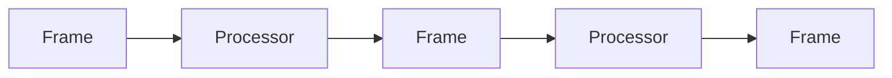

For the English Voice Coach:

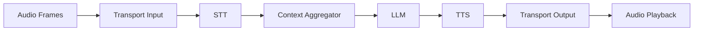
# Why Pipecat Matters

Without an orchestration framework, a developer must manually manage:

- Microphone input
    
- WebRTC signaling
    
- Audio chunk processing
    
- Speech segmentation
    
- API calls
    
- Streaming text
    
- Streaming audio
    
- Interruptions
    
- Conversation memory
    
- Resource cleanup
    

Pipecat provides standard interfaces for all of these responsibilities.

As a result, developers can focus on:

- Agent behavior
    
- Prompt design
    
- Processor order
    
- Business logic
    

instead of infrastructure details.
# The Seven Core Concepts

## 1. Transport

A **transport** connects the pipeline to the outside world.

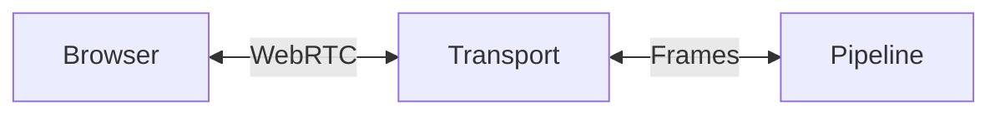

Every transport has two sides:

```python
transport.input()
transport.output()
```

|Side|Responsibility|
|---|---|
|Input|Receive user media|
|Output|Send agent media|


## 2. Processor

A **processor** receives frames, performs work, and forwards frames.

Examples:

| Processor        | Transformation           |
| ---------------- | ------------------------ |
| OpenAISTTService | Audio → Transcript       |
| OpenAILLMService | Context → Generated Text |
| OpenAITTSService | Text → Audio             |
| User Aggregator  | Transcript → Context     |

Conceptually:

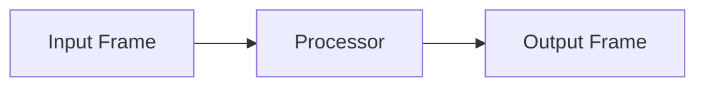

> [!tip]  
> Processors are composable. Their order defines the application.

## 3. Frame

A **frame** is a unit of information or control that moves through the pipeline.

Examples:

```text
InputAudioRawFrame
TranscriptionFrame
LLMContextFrame
LLMTextFrame
TTSAudioRawFrame
CancelFrame
```

you do not need to memorize frame classes.

Instead, remember the two major categories:

### Data Frames

Carry actual information:

- Audio
    
- Text
    
- Images
    
- Context
    

### Control Frames

Control application behavior:

- Start
    
- Stop
    
- Interrupt
    
- Trigger
    
- Configure
    

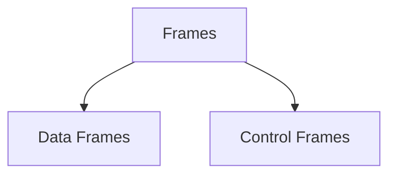

## 4. Pipeline

A **pipeline** is an ordered list of processors.

```python
pipeline = Pipeline([
    processor_a,
    processor_b,
    processor_c,
])
```

Conceptually:

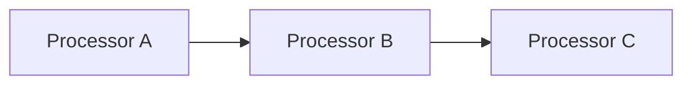

> [!important]  
> Pipeline order is executable architecture.

Changing the order changes application behavior.


## 5. PipelineWorker

A `PipelineWorker` runs a pipeline session and manages its lifecycle.

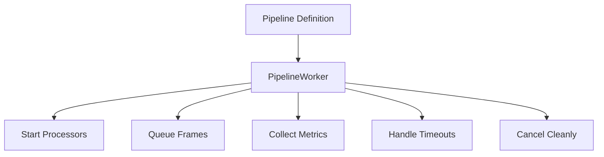

Responsibilities include:

- Starting processors
    
- Managing frame flow
    
- Tracking metrics
    
- Handling idle timeouts
    
- Cleanup and cancellation
## 6. Runner

There are two runner concepts used in this project.

### Development Runner

Responsible for:

- Starting the local server
    
- Accepting WebRTC sessions
    
- Creating agent sessions
    

The entry point:

```python
async def bot(
    runner_args: RunnerArguments
) -> None:
```
### WorkerRunner

Responsible for running the PipelineWorker.

```python
runner = WorkerRunner(
    handle_sigint=runner_args.handle_sigint
)

await runner.add_workers(worker)
await runner.run()
```

Conceptually:

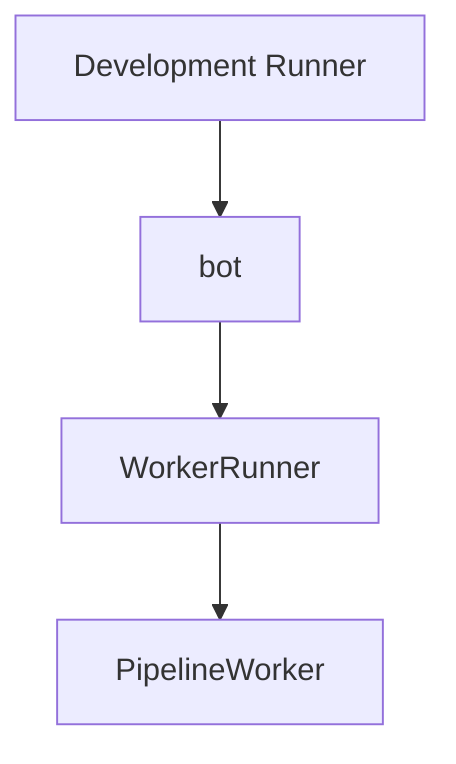

## 7. Event Handlers

Events allow application code to react to lifecycle changes.

Example:

```python
@transport.event_handler(
    "on_client_connected"
)
async def on_client_connected(
    transport,
    client
):
    ...
```

The project handles:

| Event               | Action         |
| ------------------- | -------------- |
| Client Connected    | Start greeting |
| Client Disconnected | Cancel worker  |


# Overall Architecture

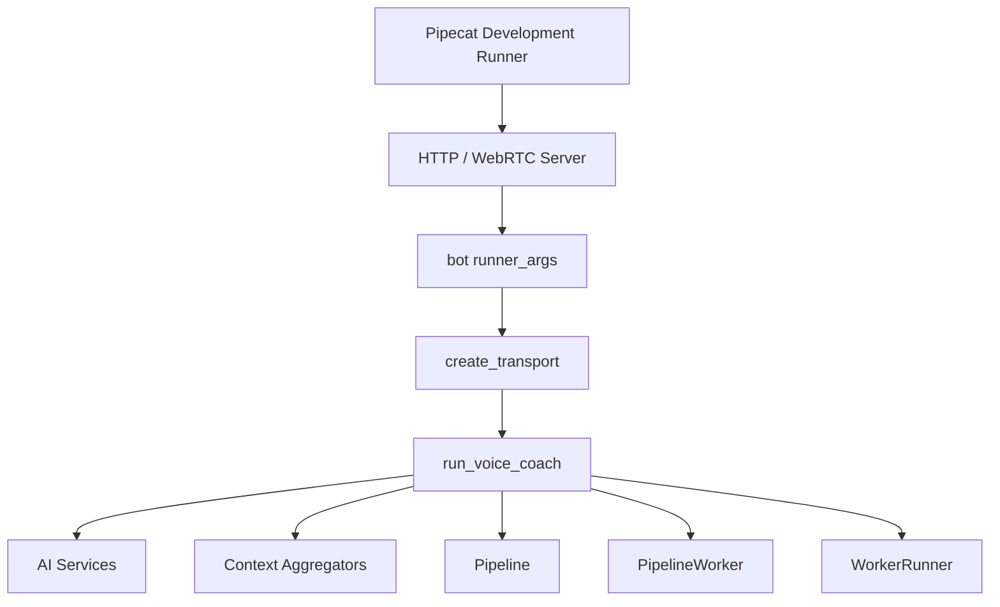

# Creating the Transport

The project defines a transport factory:

```python
TRANSPORT_PARAMS = {
    "webrtc": lambda: TransportParams(
        audio_in_enabled=True,
        audio_out_enabled=True,
    )
}
```

Later:

```python
transport = await create_transport(
    runner_args,
    TRANSPORT_PARAMS,
)
```

Flow:

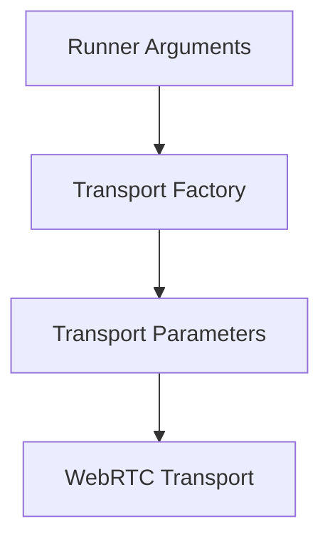
# Creating AI Services

Service classes adapt external APIs into Pipecat processors.

```python
stt = OpenAISTTService(...)
llm = OpenAILLMService(...)
tts = OpenAITTSService(...)
```

The application does **not** manually handle:

- HTTP requests
    
- Streaming responses
    
- Audio chunk conversion
    
- Event parsing
    

The service processor abstracts those details.
# Settings Objects

Modern Pipecat services use explicit settings objects.

Example:

```python
settings=OpenAISTTService.Settings(
    model=config.stt_model,
    language="en",
)
```

Another example:

```python
llm = OpenAILLMService(
    api_key=config.openai_api_key,
    settings=OpenAILLMService.Settings(
        model=config.llm_model,
        temperature=0.5,
        max_completion_tokens=220,
    ),
)
```

> [!note]  
> The service performs the work.
> 
> The settings describe how the work should be performed.


# Pipeline Lifecycle

A simplified lifecycle looks like this:

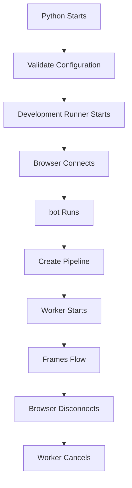
## Cleanup on Disconnect

The project handles disconnects explicitly:

```python
@transport.event_handler(
    "on_client_disconnected"
)
async def on_client_disconnected(
    transport,
    client
) -> None:
    logger.info("Learner disconnected")
    await worker.cancel()
```

> [!warning]  
> Without cleanup, tasks, network connections, and background resources may remain active.

# Practical Example: Adding a Processor

Suppose we want to log transcripts.

Where should the processor go?

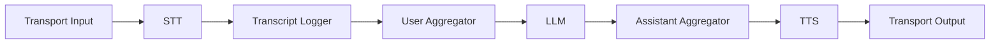

Why here?

- STT produces transcripts
    
- Logger needs transcripts
    
- Aggregator has not modified them yet
    

A useful design method:

1. What frame does the feature need?
    
2. Which processor produces that frame?
    
3. Where should the new processor be inserted?
    
4. Which frames should it forward?
    

This reasoning works for almost every Pipecat extension.


# Relevant Pipecat Code

## Session Entry Point

```python
async def bot(
    runner_args: RunnerArguments
) -> None:
    config = AppConfig.from_env()

    transport = await create_transport(
        runner_args,
        TRANSPORT_PARAMS,
    )

    await run_voice_coach(
        transport,
        runner_args,
        config,
    )
```


## PipelineWorker

```python
worker = PipelineWorker(
    pipeline,
    params=PipelineParams(
        audio_out_sample_rate=24000,
        enable_metrics=True,
        enable_usage_metrics=True,
    ),
    idle_timeout_secs=
        runner_args.pipeline_idle_timeout_secs,
)
```


## WorkerRunner

```python
runner = WorkerRunner(
    handle_sigint=
        runner_args.handle_sigint
)

await runner.add_workers(worker)
await runner.run()
```
# Common Mistakes

## Thinking Every Class Is an AI Model

Not everything in Pipecat is AI.

Examples:

- Transport
    
- Aggregator
    
- Worker
    
- Frame
    

These are orchestration components.
## Using Outdated APIs

Pipecat evolves rapidly.

Always:

- Pin versions
    
- Verify examples
    
- Read matching documentation
    

Current project version:

```text
pipecat-ai==1.4.0
```
## Mixing Configuration and Behavior

Keep responsibilities separate.

|Responsibility|Location|
|---|---|
|Secrets|`.env`|
|Model Names|`config.py`|
|Prompt Instructions|`prompts.py`|
|Pipeline Structure|`main.py`|

## Forgetting Frame Compatibility

A processor must receive frames it understands.

Bad example:

```text
Raw Audio
    |
    v
TTS
```

TTS expects text, not microphone audio.


## Skipping Cleanup

Always handle:

- Disconnects
    
- Cancellation
    
- Timeouts
    
- Resource cleanup

# Key Takeaways

> [!summary]
> 
> - Pipecat organizes real-time applications around frames and processors.
>     
> - A transport connects external clients to the pipeline.
>     
> - A pipeline is an ordered processor graph.
>     
> - PipelineWorker manages one active session.
>     
> - The development runner creates sessions and calls `bot()`.
>     
> - Service classes adapt AI APIs into Pipecat processors.
>     
> - Events connect application behavior to lifecycle changes.
>     
> - Understanding frames, processors, and pipelines is the foundation of understanding Pipecat.
>