> [!info]  
> The pipeline is the executable data-flow diagram of a Pipecat application. Frames move through processors in the exact order defined in Python.
# Concept Overview

The English Voice Coach pipeline is:

```python
pipeline = Pipeline(
    [
        transport.input(),
        stt,
        user_aggregator,
        llm,
        tts,
        transport.output(),
        assistant_aggregator,
    ]
)
```

Read it from top to bottom:

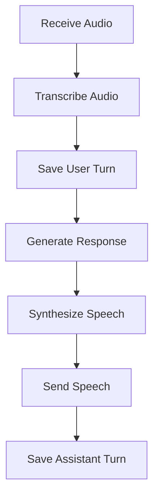

This is not just configuration.

> [!important]  
> The pipeline is executable architecture.

Every processor receives the output of the processor before it.

# Why Pipeline Order Matters

Pipeline order determines:

- Which data each processor receives
    
- When context is updated
    
- Whether the LLM sees the newest user message
    
- Whether generated responses are stored
    
- Where logging and filtering processors belong
    

A single misplaced processor can produce an application that technically runs but behaves incorrectly.

# What Is a Frame?

A **frame** is a typed message moving through the pipeline.

Think of frames as the packets that carry information between processors.


## Data Frames

Data frames carry user or system content.

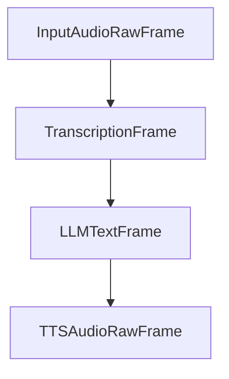

Examples:

### InputAudioRawFrame

```text
PCM microphone samples
```

### TranscriptionFrame

```text
I go yesterday to market.
```

### LLMTextFrame

```text
Good try! A more natural sentence is...
```

### TTSAudioRawFrame

```text
PCM audio generated by TTS
```

## Control Frames

Control frames do not primarily carry user content.

Instead, they tell processors that something should happen.

Examples:

```text
StartFrame
LLMRunFrame
InterruptionFrame
EndFrame
CancelFrame
```

> [!tip]  
> Data frames carry information.
> 
> Control frames carry instructions.


# Data Flow vs Control Flow

A voice agent requires both.

## Data Flow

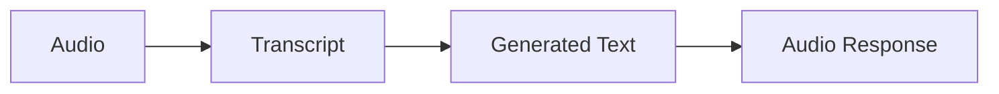


## Control Flow

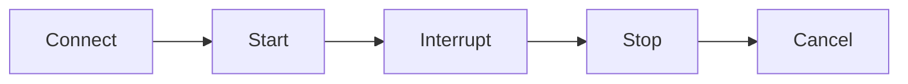

Data and control flow coexist inside the same pipeline.


# LLMRunFrame Example

When a learner first joins, no speech has occurred yet.

However, we still want the coach to greet the learner.

Pipecat accomplishes this by manually queuing a control frame:

```python
await worker.queue_frames([
    LLMRunFrame()
])
```

This tells the LLM:

> Generate a response using the current conversation context.

No microphone input is required.


# Frame Journey Through the Pipeline

Let's trace a complete learner turn.


## Step 1 — Microphone Audio Enters

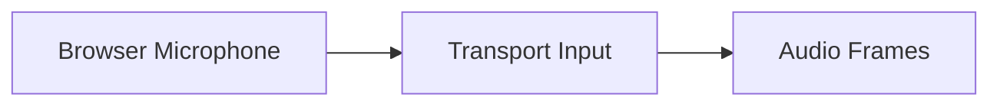

The browser sends many small audio chunks.

It does not send one large recording.


## Step 2 — VAD and Turn Detection

Pipecat observes incoming audio.

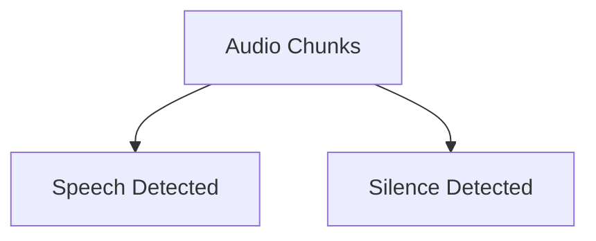

Possible events:

|Event|Meaning|
|---|---|
|Speech detected|User is speaking|
|Silence detected|Possible end of turn|

## Step 3 — STT Creates a Transcript

The STT processor receives a completed speech segment.

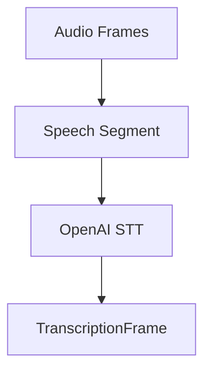

Example output:

```text
Yesterday I am visit my friend.
```
## Step 4 — User Aggregator Updates Context

The transcript is added to conversation memory.

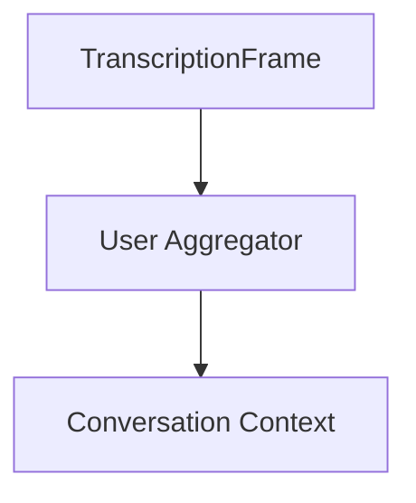

Context becomes:

```json
{
  "role": "user",
  "content": "Yesterday I am visit my friend."
}
```

## Step 5 — LLM Generates Text Frames

The LLM receives the updated context.

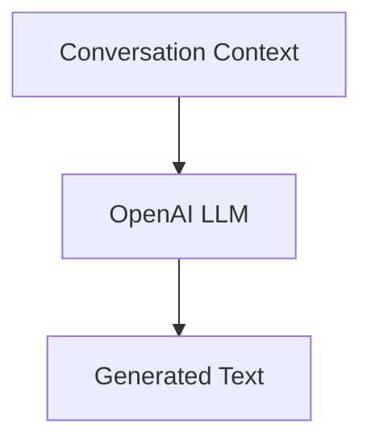

Streaming example:

```text
Good
 try!
 A more natural sentence is...
```

The full response does not need to exist before processing begins.

## Step 6 — TTS Produces Audio Frames

The generated text is converted into speech.

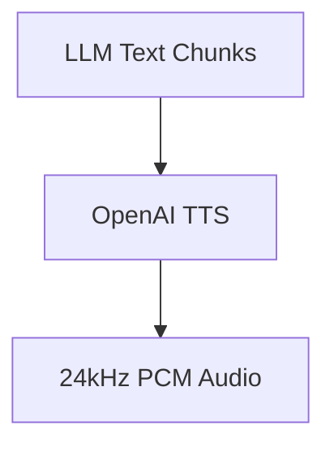

## Step 7 — Transport Sends Audio

The output transport sends audio to the learner.

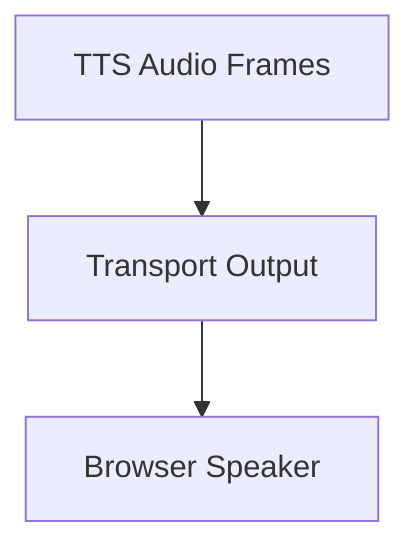


## Step 8 — Assistant Aggregator Saves the Response

Finally, the assistant's response is stored.

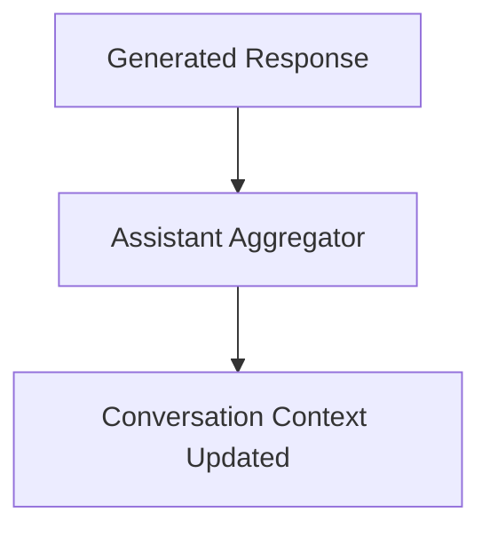

This allows the next learner turn to see the conversation history.


# Complete Frame Journey

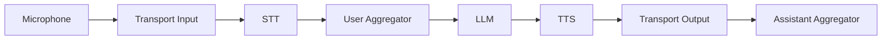


# Dependency-Based Pipeline Design

The easiest way to design pipelines is by asking:

> What data does this processor need?

---

## Correct Order

```text
STT
  ↓
User Aggregator
  ↓
LLM
```

Why?

- STT produces transcripts
    
- Aggregator stores transcripts
    
- LLM uses updated context
    

## Incorrect Order

```text
STT
  ↓
LLM
  ↓
User Aggregator
```

Problem:

The LLM may execute before the user message is added to memory.


## Another Example

Correct:

```text
LLM → TTS
```

Incorrect:

```text
TTS → LLM
```

TTS requires text.

The LLM is what produces text.

---

# Downstream and Upstream Flow

Most content moves downstream:

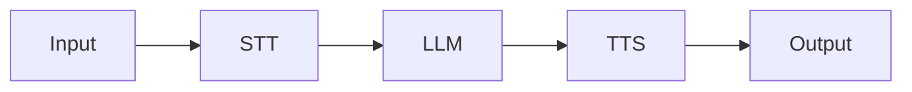

This is called **downstream flow**.


Pipecat can also send control information upstream.

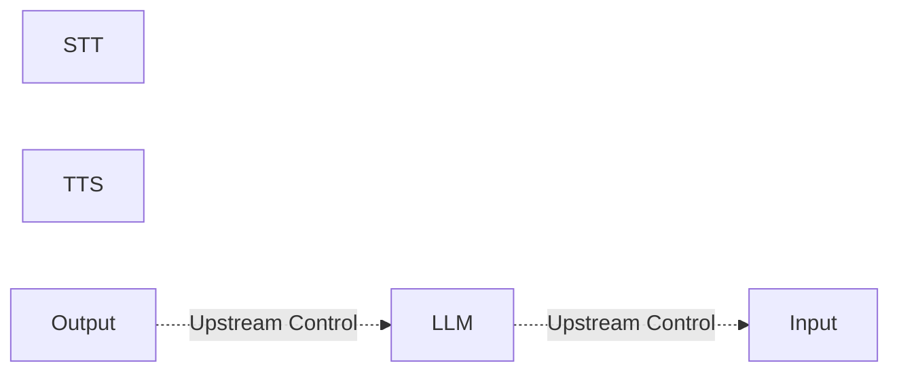

This is useful for:

- Interruptions
    
- Lifecycle management
    
- Processor coordination
    
- Cancellation
    

> [!note]  
> A Pipecat pipeline is not simply a one-way chain of function calls.


# Queuing Frames Manually

Application code can inject frames directly.

Example:

```python
context.add_message(
    {
        "role": "developer",
        "content": START_CONVERSATION_PROMPT,
    }
)

await worker.queue_frames([
    LLMRunFrame()
])
```

Execution flow:

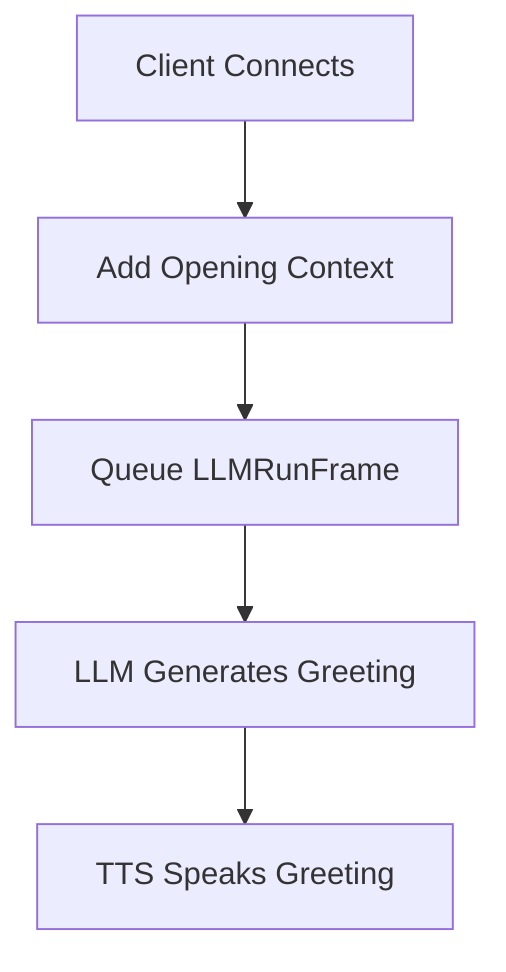

Useful for:

- Opening greetings
    
- Scheduled announcements
    
- Reminder messages
    
- Tool results

# Example: Profanity Filter

Suppose we want to filter generated text before speech.

Correct placement:

```text
LLM
 ↓
Text Filter
 ↓
TTS
```

Reasoning:

1. Filter needs text
    
2. LLM produces text
    
3. TTS consumes text
    

Pipeline:

```python
pipeline = Pipeline(
    [
        transport.input(),
        stt,
        user_aggregator,
        llm,
        response_filter,
        tts,
        transport.output(),
        assistant_aggregator,
    ]
)
```

> [!warning]  
> If the filter is placed after TTS, it receives audio instead of text.

# Example: Transcript Logger

Desired flow:

```text
STT
 ↓
Transcript Logger
 ↓
User Aggregator
```

Processor:

```python
class TranscriptLogger(FrameProcessor):

    async def process_frame(
        self,
        frame,
        direction,
    ):
        await super().process_frame(
            frame,
            direction,
        )

        if isinstance(
            frame,
            TranscriptionFrame,
        ):
            print(
                "Learner:",
                frame.text,
            )

        await self.push_frame(
            frame,
            direction,
        )
```

The critical line is:

```python
await self.push_frame(
    frame,
    direction,
)
```

Without forwarding the frame, downstream processors may never receive it.


# PipelineWorker Responsibilities

The pipeline describes structure.

The worker manages execution.

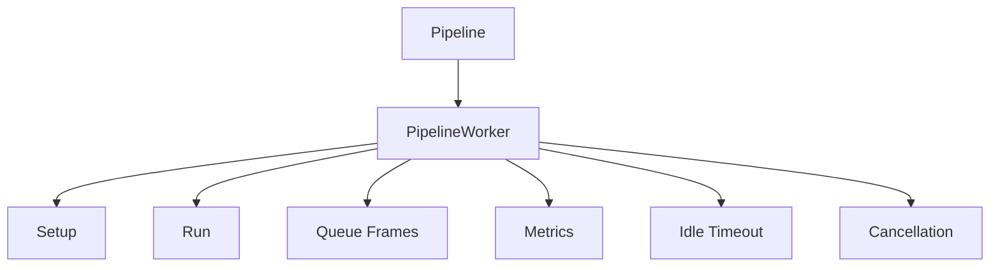

Project configuration:

```python
worker = PipelineWorker(
    pipeline,
    params=PipelineParams(
        audio_out_sample_rate=24000,
        enable_metrics=True,
        enable_usage_metrics=True,
    ),
    idle_timeout_secs=
        runner_args.pipeline_idle_timeout_secs,
)
```

> [!important]  
> The output sample rate must match the audio format expected by the TTS pipeline.


# Relevant Pipecat Code

## Main Pipeline

```python
pipeline = Pipeline(
    [
        transport.input(),
        stt,
        user_aggregator,
        llm,
        tts,
        transport.output(),
        assistant_aggregator,
    ]
)
```


## Manual Control Frame

```python
await worker.queue_frames([
    LLMRunFrame()
])
```

These two snippets represent the two major ideas:

|Concept|Example|
|---|---|
|Normal Data Flow|Pipeline|
|Manual Trigger|Queued Control Frame|


# Common Mistakes

## Treating the Pipeline as Configuration

The pipeline is executable architecture.

Changing order changes behavior.


## Not Forwarding Frames

Custom processors must usually forward frames.

```python
await self.push_frame(
    frame,
    direction,
)
```

## Filtering the Wrong Data Type

Always place processors where their required data exists.

|Processor Type|Required Data|
|---|---|
|Transcript Logger|Text|
|Safety Filter|Text|
|Audio Enhancer|Audio|


## Triggering LLM Too Early

Wrong:

```text
Queue LLMRunFrame
      ↓
Add Context
```

Correct:

```text
Add Context
      ↓
Queue LLMRunFrame
```

## Saving Context Too Early

Store the response that was actually generated.

Not a hypothetical future response.

## Ignoring Audio Sample Rates

Mismatched formats may cause:

- Distorted playback
    
- Failed playback
    
- Unexpected latency
    
# Key Takeaways

> [!summary]
> 
> - Frames are typed units of data or control.
>     
> - Processors transform or react to frames.
>     
> - Pipeline order expresses data dependencies.
>     
> - Most user content moves downstream.
>     
> - Control information can move upstream.
>     
> - LLMRunFrame manually triggers LLM execution.
>     
> - PipelineWorker manages execution and lifecycle.
>     
> - New processors should be inserted where their required frame type exists.
>     
> - Understanding pipelines and frames is the foundation of understanding Pipecat.
>