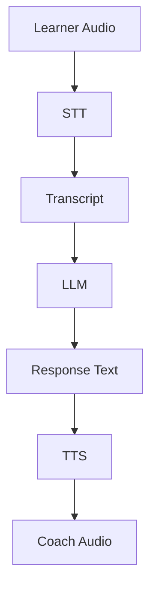
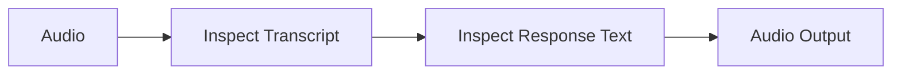
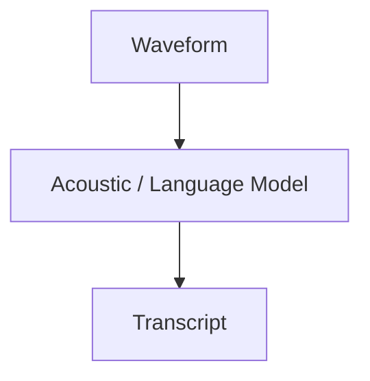
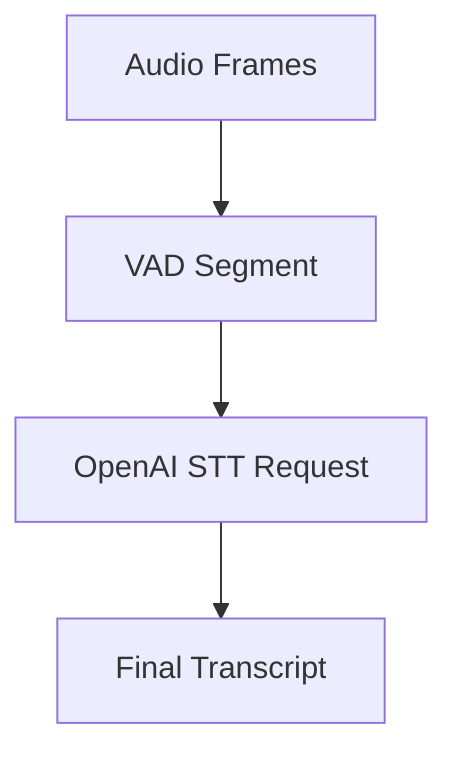
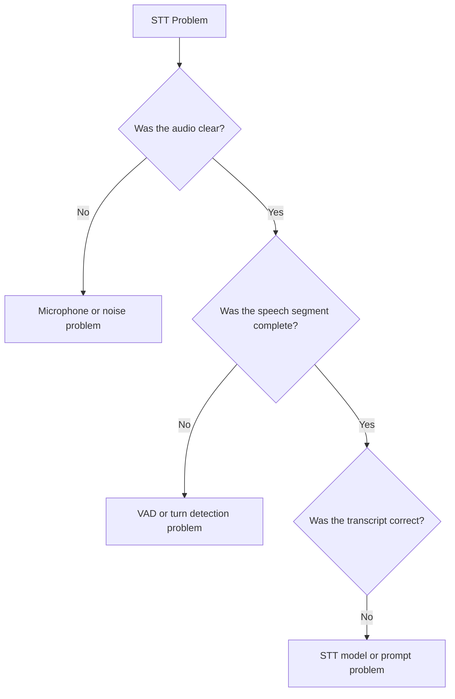
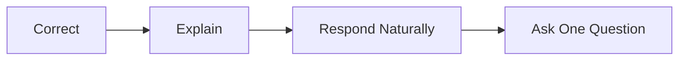
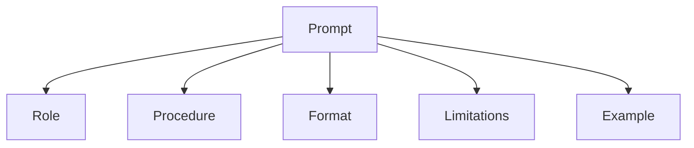
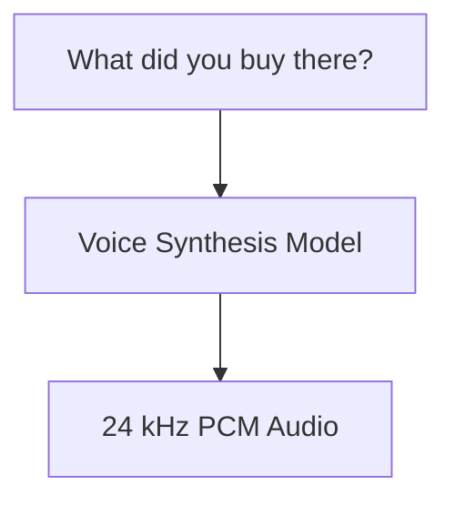

> [!info]  
> This chapter explains the three OpenAI-powered stages used in the English Voice Coach: speech-to-text, language generation, and text-to-speech.
# Concept Overview

The English Voice Coach uses three main AI stages:

| Stage | Transformation                 |
| ----- | ------------------------------ |
| STT   | Speech → Text                  |
| LLM   | Text / Context → Response Text |
| TTS   | Response Text → Speech         |

Together, they form the core voice loop:



Each stage solves a different problem.

> [!important]  
> STT, LLM, and TTS should be configured, tested, and debugged separately.
# Why This Matters

When the final spoken answer sounds wrong, the cause may be in any stage.

|Problem Source|Example|
|---|---|
|STT Error|`market` becomes `marker`|
|LLM Error|Transcript is correct, but correction is unhelpful|
|TTS Issue|Text is correct, but speech sounds unclear|

A disciplined debugging process checks intermediate results:



This is one major advantage of the chained architecture.

# Speech-to-Text

## What STT Does

Speech-to-text estimates the words spoken in an audio segment.



Example output:

```text
I went to the market yesterday.
```

STT is not a perfect copy of reality.

It is affected by:

- Microphone quality
    
- Background noise
    
- Accent
    
- Speaking speed
    
- Vocabulary
    
- Segment boundaries
    
- Model behavior
## Project STT Configuration

```python
stt = OpenAISTTService(
    api_key=config.openai_api_key,
    settings=OpenAISTTService.Settings(
        model=config.stt_model,
        language="en",
        prompt=(
            "This is an English-learning conversation. Preserve the learner's "
            "actual grammar and wording instead of silently correcting it."
        ),
    ),
)
```

The project uses HTTP, VAD-segmented transcription.

That means:



Pipecat waits for a completed speech segment, sends it to OpenAI, and receives a transcript.

## Why the STT Prompt Matters

A normal transcription system may normalize language.

An educational coach needs the learner's original wording.

Example:

|Type|Text|
|---|---|
|Spoken Sentence|`I go yesterday to market.`|
|Undesired Normalized Transcript|`I went to the market yesterday.`|
|Desired Faithful Transcript|`I go yesterday to market.`|

> [!warning]  
> If STT silently fixes the learner's sentence, the LLM loses the mistake it needs to teach.

## STT Failure Analysis

Use this checklist when transcription seems wrong:




# Large Language Model

## What the LLM Does

The LLM receives structured conversation context:

```text
system instruction
developer message
previous user turns
previous assistant turns
latest user turn
```

It generates the next assistant response.

In this project, the response has four jobs:




## Project LLM Configuration

```python
llm = OpenAILLMService(
    api_key=config.openai_api_key,
    settings=OpenAILLMService.Settings(
        model=config.llm_model,
        system_instruction=ENGLISH_COACH_SYSTEM_PROMPT,
        temperature=0.5,
        max_completion_tokens=220,
    ),
)
```


## System Instruction

The system instruction defines stable behavior.

Example:

```text
You are a friendly English conversation coach...
```

It also includes voice-specific output constraints:

- Short responses
    
- No Markdown
    
- No emojis
    
- No long lectures
    
- One follow-up question
    

> [!tip]  
> Voice prompts should be written for ears, not screens.

## Temperature

Temperature controls how varied the model's responses are.

|Temperature|Behavior|
|---|---|
|Lower|More focused and repeatable|
|Higher|More varied and creative|

For grammar correction, very high creativity can reduce consistency.

The project uses:

```python
temperature=0.5
```


## Completion Limit

The project uses:

```python
max_completion_tokens=220
```

This acts as a safety rail against long answers.

It supports the desired behavior:

> short, clear, spoken coaching responses.


## Prompt Decomposition

A maintainable prompt separates responsibilities:



|Section|Purpose|
|---|---|
|Role|Friendly English coach|
|Procedure|Understand → Correct → Explain → Respond → Ask|
|Format|Concise spoken language|
|Limitations|Do not claim detailed pronunciation analysis|
|Example|Incorrect sentence → Helpful correction|

This is easier to modify than one large paragraph.
# Text-to-Speech

## What TTS Does

TTS converts generated text into audio samples.



## Project TTS Configuration

```python
tts = OpenAITTSService(
    api_key=config.openai_api_key,
    settings=OpenAITTSService.Settings(
        model=config.tts_model,
        voice=config.tts_voice,
        instructions=(
            "Speak like a patient, friendly English teacher. Use clear "
            "pronunciation, a warm tone, and a slightly slow pace."
        ),
    ),
)
```

TTS settings control presentation:

|Setting|Controls|
|---|---|
|Model|Synthesis capability|
|Voice|Voice identity / style|
|Instructions|Tone and pacing|

> [!important]  
> The LLM decides what to say. TTS decides how it sounds.


# Audio Sample Rate

The project matches the TTS output format with the pipeline output configuration.

```python
PipelineParams(
    audio_out_sample_rate=24000
)
```

Conceptually:

```text
TTS output:        24,000 samples / second
Pipeline output:   24,000 samples / second
------------------------------------------
Formats agree
```

> [!warning]  
> Mismatched sample rates may cause distorted playback or failed audio output.

# End-to-End Example

Input:

```text
My brother have two car.
```

Possible STT output:

```json
{
  "text": "My brother have two car."
}
```

Conversation context:

```json
[
  {
    "role": "user",
    "content": "My brother have two car."
  }
]
```

Possible LLM output:

```text
Good try! A natural sentence is: My brother has two cars.

We use has with he, she, or one person, and cars is plural after two.

What kind of cars does he have?
```

TTS then converts this text into audio frames for playback.


# Practical Experiments

## Experiment A — Change Only the Voice

In `.env`:

```dotenv
OPENAI_TTS_VOICE=coral
```

Change it to another supported voice.

Expected result:

```text
same transcript
same correction behavior
different spoken voice
```

---

## Experiment B  Change Only the Coach Style

In `prompts.py`, add:

```text
Use vocabulary suitable for an A2 learner.
```

Expected result:

```text
same audio transport
same STT
simpler LLM language
same TTS voice
```
## Experiment C — Change Only the STT Prompt

Remove the instruction to preserve learner mistakes, then compare transcripts.

This tests whether transcription normalization changes the educational signal.

Expected result:

```text
possible change in transcript faithfulness
same LLM prompt
same TTS voice
```

# Relevant Pipecat Code

All three services use the same API key:

```python
api_key=config.openai_api_key
```

Model names come from `AppConfig`:

```python
stt_model = os.getenv(
    "OPENAI_STT_MODEL",
    "gpt-4o-transcribe",
)

llm_model = os.getenv(
    "OPENAI_LLM_MODEL",
    "gpt-4.1-mini",
)

tts_model = os.getenv(
    "OPENAI_TTS_MODEL",
    "gpt-4o-mini-tts",
)

tts_voice = os.getenv(
    "OPENAI_TTS_VOICE",
    "coral",
)
```

This allows experimentation without changing pipeline structure.


# Common Mistakes

## Treating STT Output as Absolute Truth

The transcript is a model prediction.

It can be wrong.


## Asking the LLM to Evaluate Audio It Never Received

In this chained design, the LLM receives text.

It cannot inspect detailed pronunciation directly.

## Writing for Screens Instead of Ears

Avoid spoken responses with:

- Markdown tables
    
- Long bullet lists
    
- Raw URLs
    
- Long paragraphs
    

These may be readable on screen but poor when spoken.

## Making Responses Too Long

Long responses increase:

- LLM generation time
    
- TTS generation time
    
- Learner cognitive load
    
- Conversation delay

## Changing Models Without Checking Compatibility

Model names and supported settings can change.

Always verify:

- Provider documentation
    
- Pipecat integration version
    
- Required settings

## Mismatching Audio Sample Rates

The output pipeline should match the TTS format.

```python
audio_out_sample_rate=24000
```

## Blaming TTS for Bad Wording

Inspect the generated text first.

TTS may be correctly speaking an awkward LLM response.

# Key Takeaways

> [!summary]
> 
> - STT, LLM, and TTS solve different problems.
>     
> - Inspect transcripts and generated text when debugging.
>     
> - The STT prompt should preserve learner mistakes.
>     
> - The LLM prompt must be designed for spoken output.
>     
> - TTS controls voice presentation, not teaching logic.
>     
> - Voice responses should stay short and conversational.
>     
> - Match the pipeline audio rate to the TTS service.
>