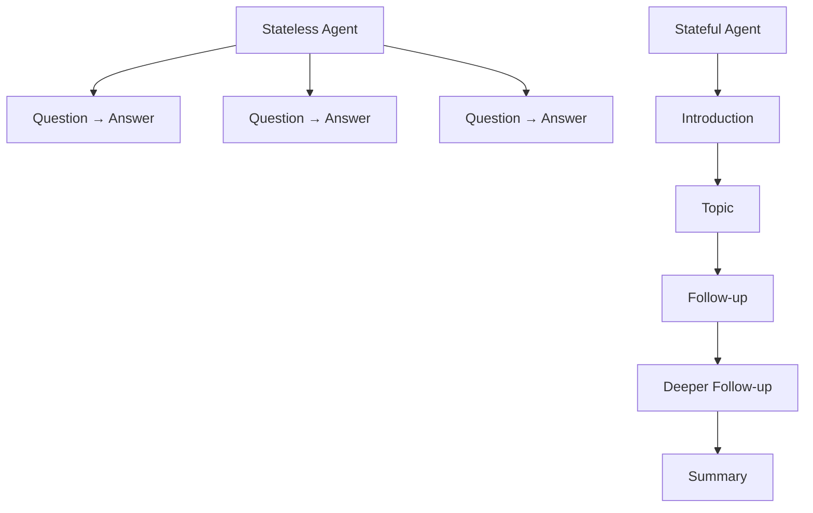
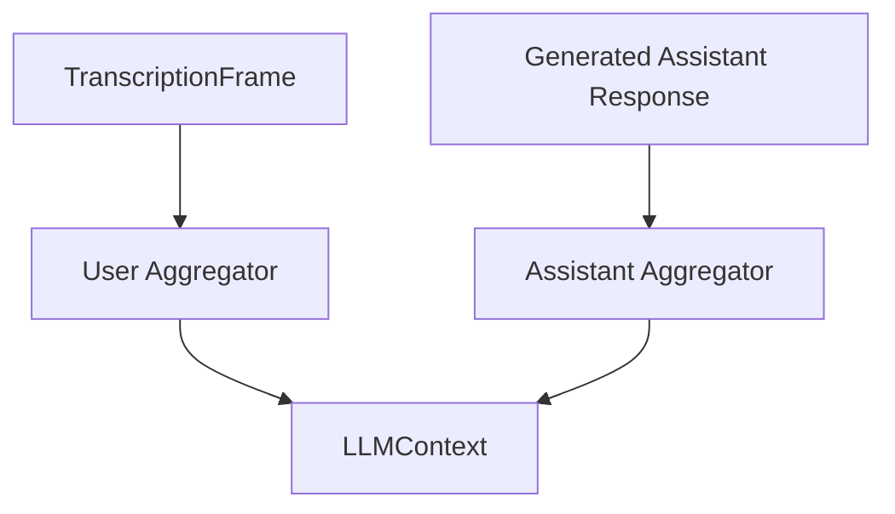
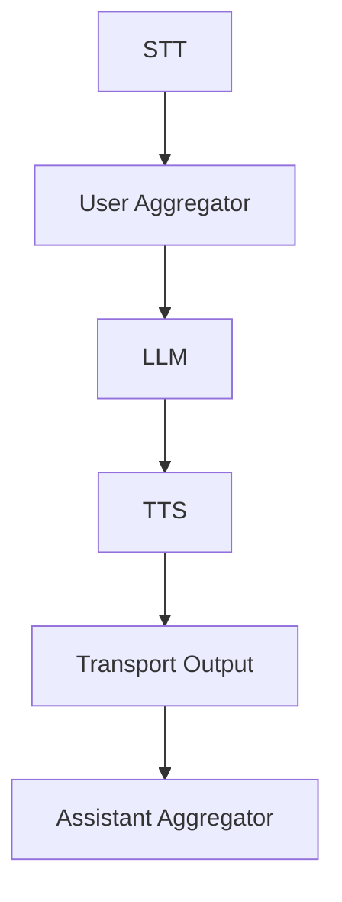
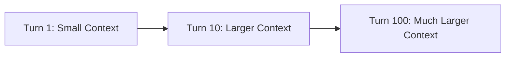
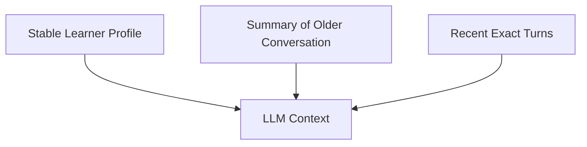
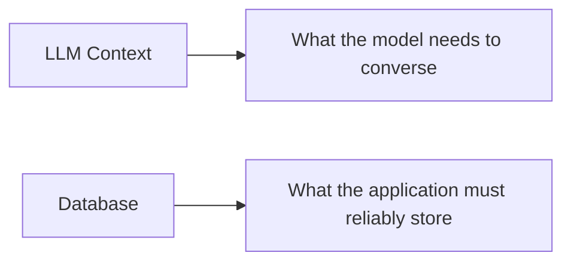
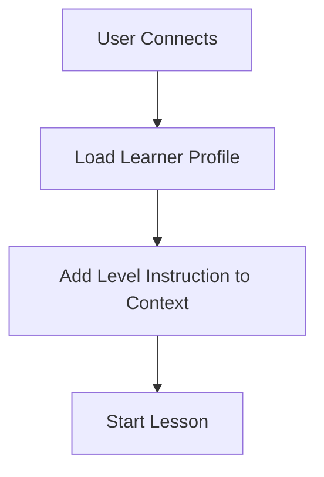

> [!info]  
> Context is the ordered conversation history that the LLM uses to understand the current turn.
# Concept Overview

Without context, the model sees each user message in isolation.

Example:

```text
Learner: I visited my aunt.
Coach: Who did you visit?

Learner: She lives in Aleppo.
LLM sees only: "She lives in Aleppo."
```

Question:

```text
Who is "she"?
```

With context, the model sees the previous turns:

```text
user: I visited my aunt.
assistant: Who did you visit?
user: She lives in Aleppo.
```

Now the LLM can infer that **she** refers to **the aunt**.

---

# Project Context Setup

The project creates one shared context object:

```python
context = LLMContext()
```

Then it creates two aggregators:

```python
user_aggregator, assistant_aggregator = LLMContextAggregatorPair(
    context,
    user_params=LLMUserAggregatorParams(
        vad_analyzer=SileroVADAnalyzer(),
    ),
)
```

Both aggregators update the same `LLMContext`.

---

# Why Context Matters

An English conversation coach must remember:

- Its previous question
    
- The learner's earlier answer
    
- The conversation topic
    
- Corrections already explained
    
- The learner's level or goal, if provided
    

Without memory, the agent becomes a set of unrelated one-turn responses.



> [!tip]  
> Context turns the LLM from a text completion engine into a conversation participant.

---

# What Is Stored in Context?

A simplified context is a list of messages.

```json
[
  {
    "role": "user",
    "content": "I enjoy cooking."
  },
  {
    "role": "assistant",
    "content": "That is great. What do you like to cook?"
  },
  {
    "role": "user",
    "content": "Usually I cook rice and chicken."
  }
]
```

---

# Message Roles

|Role|Purpose|
|---|---|
|`system`|Stable behavior and policy|
|`developer`|Application-level instruction for a specific action|
|`user`|Learner content|
|`assistant`|Coach content|

In this project:

|Instruction Type|Location|
|---|---|
|Long-term teaching behavior|LLM system instruction|
|Opening greeting trigger|Developer message|

---

# User and Assistant Aggregators

The two aggregators update context from different sides of the conversation.



## User Aggregator

```text
transcript → user_aggregator → context
```

It stores what the learner said.

---

## Assistant Aggregator

```text
generated response → assistant_aggregator → context
```

It stores what the coach said.

---

# Context Placement in the Pipeline

The project order is:



This order matters.

---

## User Turn Before LLM

Correct:

```text
new transcript → context updated → LLM reads context
```

The LLM must see the newest learner message before generating a response.

---

## Assistant Turn After Response

Correct:

```text
LLM response → spoken → context updated
```

The assistant response should be stored so the next turn remains coherent.

If assistant replies are not stored, the model may forget:

- What it previously asked
    
- What correction it gave
    
- What topic it was following
    

---

# Opening Message

When the browser connects, the project adds a developer message:

```python
context.add_message(
    {
        "role": "developer",
        "content": START_CONVERSATION_PROMPT,
    }
)

await worker.queue_frames([
    LLMRunFrame()
])
```

---

## State Before Connection

```text
context: []
```

---

## State After Adding the Message

```text
context:
developer: Start the lesson now...
```

Then `LLMRunFrame` tells the LLM to generate a response from that context.

---

## Possible Context After Greeting

```text
developer: Start the lesson now...
assistant: Hello! I am your AI English conversation coach...
```

---

# Short-Term Memory vs Long-Term Memory

This MVP implements short-term conversational memory.

```text
memory exists during one live session
```

When the process or session ends, context is not saved in a database.

---

## Short-Term Context

```text
current conversation only
```

Examples:

- Current topic
    
- Previous question
    
- Recent correction
    
- Current lesson flow
    

---

## Long-Term Memory

```text
saved across sessions
```

Possible examples:

- Learner name
    
- CEFR level
    
- Repeated grammar errors
    
- Vocabulary mastered
    
- Previous lesson topic
    
- Preferred speaking speed
    

> [!note]  
> Long-term memory is intentionally outside this MVP.

---

# Context Size and Cost

As conversation history grows, LLM input grows.



Consequences:

- More input tokens
    
- Higher cost
    
- More processing time
    
- Possible context limits
    
- Old irrelevant details may distract the model
    

---

# Production Memory Strategy

Production systems often combine three layers:



Example:

```text
Stable learner profile:
level = B1
goal = travel

Summary of older conversation:
Discussed food and hobbies.

Recent exact turns:
Last 6 messages.
```

This keeps the context useful without sending unlimited history.

---

# Context Is Not a Database

`LLMContext` supports conversation flow.

It should not become the only storage system for important application data.

Use structured storage for:

- User accounts
    
- Course progress
    
- Grades
    
- Billing
    
- Consent records
    
- Audit data
    



> [!warning]  
> Do not store secrets, API keys, or private infrastructure credentials in model context.

---

# Practical Example: Learner Level

For one session, add a developer message:

```python
context.add_message(
    {
        "role": "developer",
        "content": (
            "The learner is at A2 level. "
            "Use short questions and common words."
        ),
    }
)
```

The context now contains a session-specific instruction.

---

## Persistent Application Flow

For a production app:



The learner level should come from a database, not hardcoded text.

---

# Practical Example: Repeated-Error Memory

Suppose we want to track repeated past-tense mistakes.

Do not rely only on free-form context.

Use structured state:

```python
learner_stats = {
    "past_tense_errors": 0,
    "article_errors": 0,
}
```

After detecting a correction:

```python
learner_stats["past_tense_errors"] += 1
```

Later, add concise guidance to context:

```python
context.add_message(
    {
        "role": "developer",
        "content": (
            "The learner has repeated past-tense errors. "
            "Give one short past-tense reminder when relevant."
        ),
    }
)
```

This combines:

- Reliable structured data
    
- Conversational guidance
    

---

# Practical Example: Inspect a Conversation

After three turns, mentally reconstruct the context:

```text
system:
You are a friendly English coach...

developer:
Start the lesson now...

assistant:
Hello! How are you today?

user:
I am good and I go to university today.

assistant:
Good! A natural sentence is...

user:
I study computer science.
```

Ask:

1. Does the newest user message appear before the LLM runs?
    
2. Is the previous assistant question preserved?
    
3. Are temporary instructions being repeated unnecessarily?
    
4. Is old context still relevant?
    

---

# Relevant Pipecat Code

## Creating Shared Context

```python
context = LLMContext()
```

---

## Creating the Aggregator Pair

```python
user_aggregator, assistant_aggregator = LLMContextAggregatorPair(
    context,
    user_params=LLMUserAggregatorParams(
        vad_analyzer=SileroVADAnalyzer(),
    ),
)
```

---

## Pipeline Placement

```python
[
    stt,
    user_aggregator,
    llm,
    tts,
    transport.output(),
    assistant_aggregator,
]
```

---

## Manual Message Insertion

```python
context.add_message(
    {
        "role": "developer",
        "content": START_CONVERSATION_PROMPT,
    }
)
```

---

# Common Mistakes

## Forgetting Assistant History

If assistant messages are not stored, the LLM loses its own earlier questions and explanations.

---

## Adding the User Turn After the LLM

The LLM may answer stale context.

Correct:

```text
user message → context → LLM
```

---

## Treating Context as Permanent Storage

Session context is not a reliable student-record database.

Use a real database for persistent data.

---

## Keeping Unlimited History

Unlimited context causes:

- Higher cost
    
- Higher latency
    
- Context window pressure
    
- More irrelevant information
    

---

## Storing Secrets in Context

The model does not need:

- API keys
    
- Database passwords
    
- Private infrastructure credentials
    

---

## Mixing Facts and Instructions Carelessly

Use clear roles and concise messages.

The model should distinguish:

|Type|Example|
|---|---|
|Learner Fact|The learner is at A2 level|
|Behavior Rule|Use short questions and common words|

---

# Key Takeaways

> [!summary]
> 
> - Context is ordered conversation history for the LLM.
>     
> - User and assistant aggregators update the same context.
>     
> - User content must be stored before the LLM runs.
>     
> - Assistant content must be stored for coherent follow-ups.
>     
> - This project has session memory, not persistent long-term memory.
>     
> - Use databases for reliable learner records.
>     
> - Summarize or trim long conversations in production.
>