> [!info]  
> A transport connects the Pipecat pipeline to an external client. In this project, the client is a browser and the transport technology is WebRTC.
# Concept Overview

The browser provides:

- Microphone input
    
- Speaker output
    
- User connection lifecycle

Pipecat provides:

- Transport processors
    
- Pipeline integration
    
- Event handling
    
- Audio frame movement
    

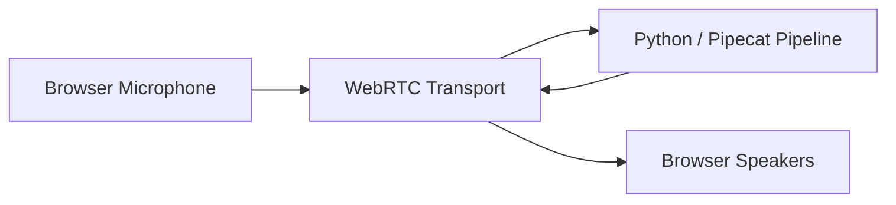

> [!important]  
> The transport does not correct English and does not call the LLM.  
> It only moves media and connection events.


# Why Transports Matter

The AI pipeline is useless if audio cannot enter and leave reliably.

The transport answers questions such as:

- How does microphone audio reach Python?
    
- How is generated audio returned?
    
- When did the client connect?
    
- When did the client disconnect?
    
- What audio format is being exchanged?
    
- How are network delays handled?
    

Separating transport from intelligence allows the same agent logic to work through different channels:

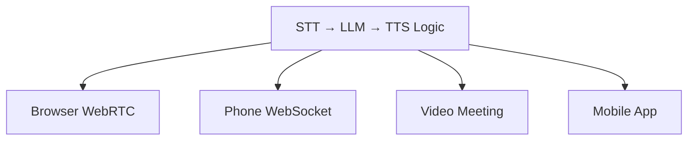


# What WebRTC Provides

WebRTC is a real-time communication technology commonly used for browser audio and video.

Simplified flow:

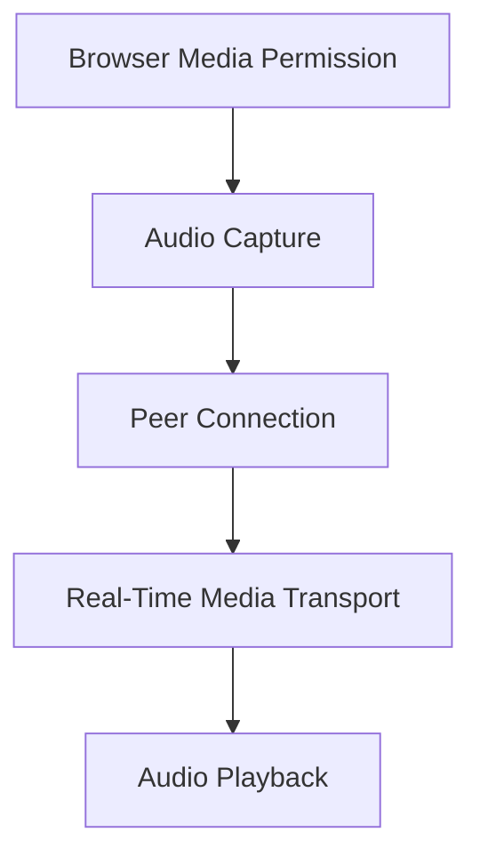

WebRTC is designed for low-latency interactive media, which makes it suitable for voice agents.

# WebRTC Is Not the Web Page

Three layers are easy to confuse:

|Layer|Responsibility|
|---|---|
|Browser UI|Buttons, status, microphone permission|
|WebRTC Connection|Real-time audio transport|
|Pipecat Pipeline|STT, context, LLM, TTS|

> [!tip]  
> Pipecat's development runner provides a ready-made local client page, so this project does not need custom HTML or JavaScript.

# Local Runner Architecture

Run:

```powershell
python main.py -t webrtc
```

Simplified startup sequence:

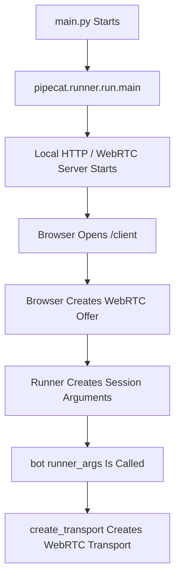

The browser URL is usually:

```text
http://localhost:7860/client
```
# Transport Configuration

The project declares:

```python
TRANSPORT_PARAMS = {
    "webrtc": lambda: TransportParams(
        audio_in_enabled=True,
        audio_out_enabled=True,
    )
}
```

Meaning:

|Setting|Meaning|
|---|---|
|`audio_in_enabled=True`|Accept learner microphone audio|
|`audio_out_enabled=True`|Send coach audio to the browser|

No video is required for this project.

# Why a Factory Is Used

`TRANSPORT_PARAMS` stores a function:

```python
"webrtc": lambda: TransportParams(...)
```

The parameters are created when the transport type is selected.

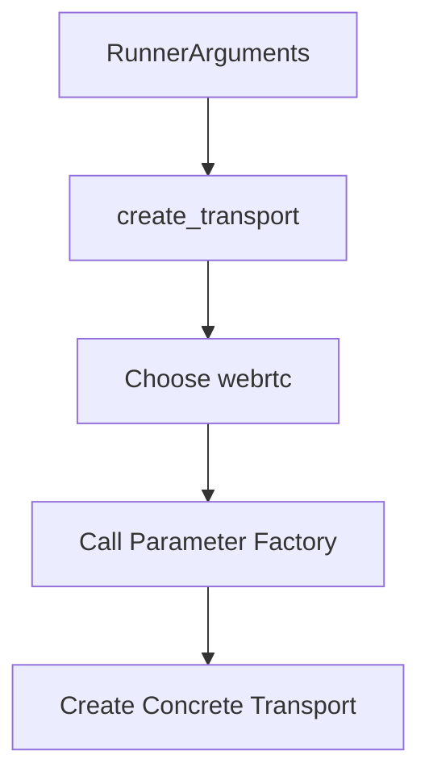

Project code:

```python
transport = await create_transport(
    runner_args,
    TRANSPORT_PARAMS,
)
```

This pattern allows new transport types to be added later without rewriting the agent pipeline.

# Input and Output Processors

The transport exposes two pipeline processors:

```python
transport.input()
transport.output()
```

They define the boundary between the outside world and the Pipecat pipeline.

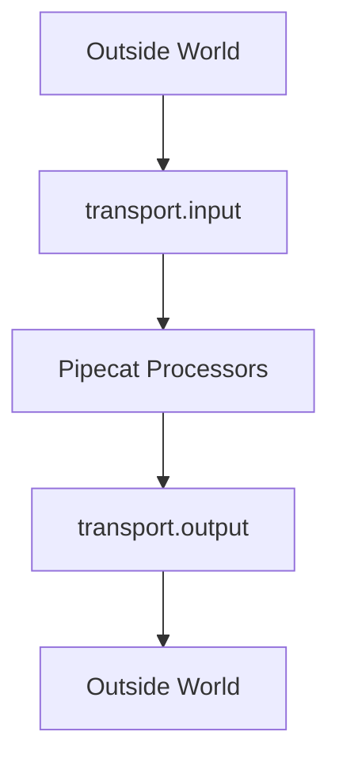

Placement matters:

|Processor|Correct Placement|Reason|
|---|---|---|
|`transport.input()`|Before STT|STT needs incoming audio|
|`transport.output()`|After TTS|Output needs generated audio|

# Connection Events

The project reacts when the client connects:

```python
@transport.event_handler("on_client_connected")
async def on_client_connected(
    transport,
    client,
) -> None:
    logger.info("Learner connected")

    context.add_message(
        {
            "role": "developer",
            "content": START_CONVERSATION_PROMPT,
        }
    )

    await worker.queue_frames([
        LLMRunFrame()
    ])
```

Sequence:

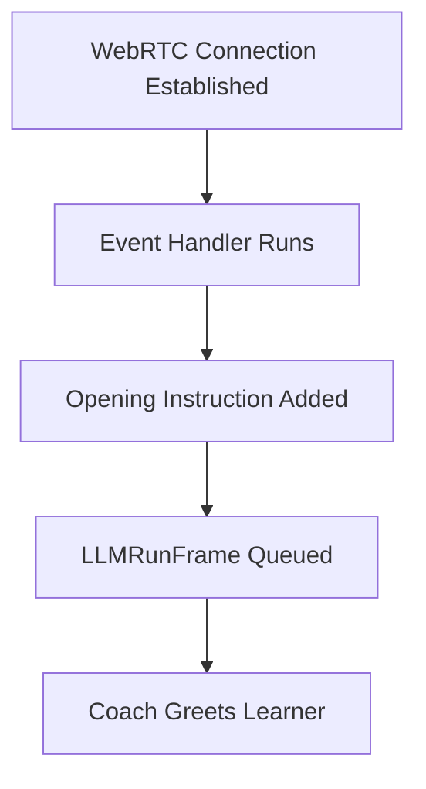

## Disconnect Event

```python
@transport.event_handler("on_client_disconnected")
async def on_client_disconnected(
    transport,
    client,
) -> None:
    logger.info("Learner disconnected")
    await worker.cancel()
```

This connects the network lifecycle to the pipeline lifecycle.

> [!warning]  
> If the client disconnects but the worker is not cancelled, background tasks may remain active.

# Localhost and Microphone Permissions

Browsers restrict microphone access for security.

During development, `localhost` is treated as a secure context by major browsers.

Common local flow:

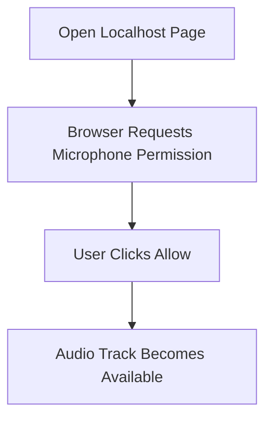

If permission is denied:

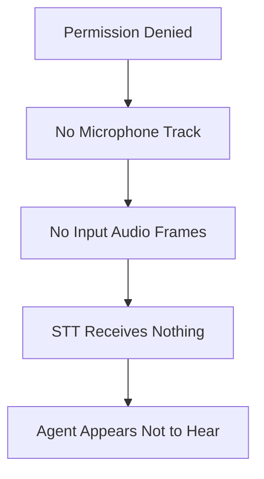

> [!important]  
> This is a transport or client problem, not an LLM problem.


# Echo and Feedback

Without headphones, the agent may hear itself.

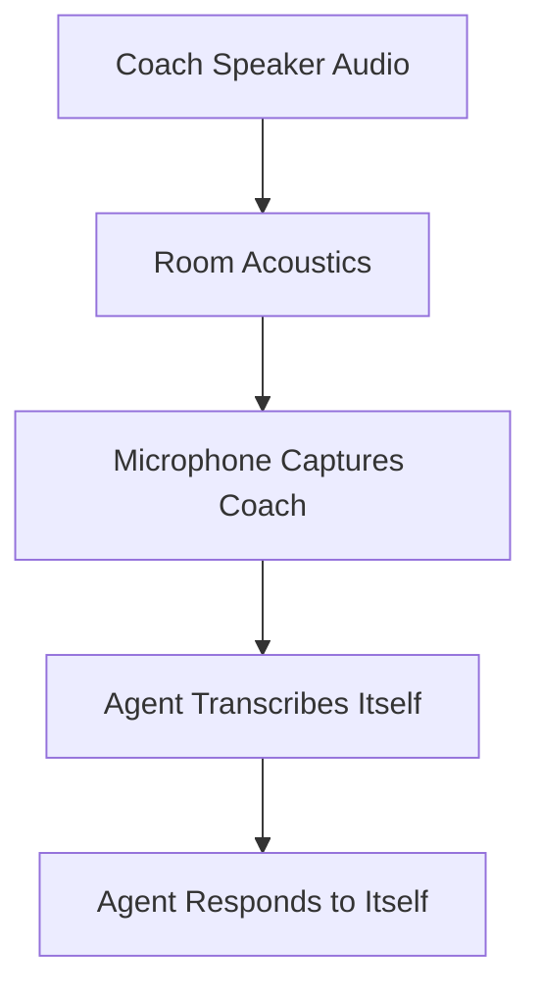

Use headphones during development.

Production systems may also use:

- Echo cancellation
    
- Noise suppression
    
- Audio gain control
    
- Better turn detection
    


# Network Latency and Jitter

Network packets do not always arrive at perfectly regular intervals.

```text
sent:     1 2 3 4 5 6
arrives:  1 2   3 4   5 6
```

Jitter buffers smooth irregular timing but add delay.

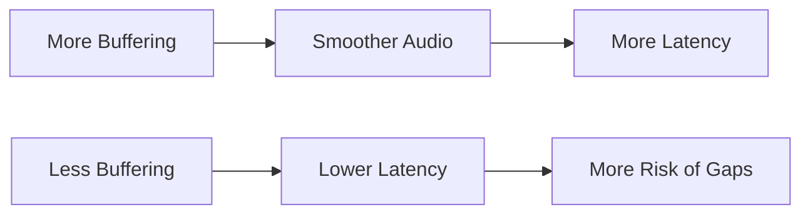

Voice engineering is a balance between smoothness and responsiveness.

# Transport Alternatives

The same intelligence pipeline can connect to different channels.

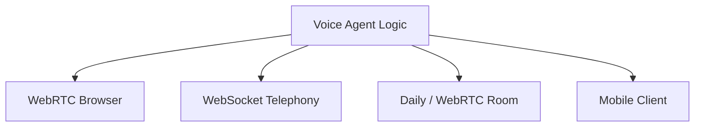

Examples:

|Transport|Best For|
|---|---|
|WebRTC Browser|Local demos and web apps|
|WebSocket Telephony|Phone providers streaming call audio|
|Daily / WebRTC Room|Meeting-style sessions|
|Mobile Client|Native app integration|

## Conceptual Multi-Transport Factory

```python
transport_params = {
    "webrtc": lambda: TransportParams(
        audio_in_enabled=True,
        audio_out_enabled=True,
    ),

    "daily": lambda: DailyParams(
        audio_in_enabled=True,
        audio_out_enabled=True,
    ),

    "websocket": lambda: FastAPIWebsocketParams(
        audio_in_enabled=True,
        audio_out_enabled=True,
    ),
}
```

The current project intentionally includes only WebRTC.

# Practical Debugging

## The Agent Cannot Hear Me

Use this order:

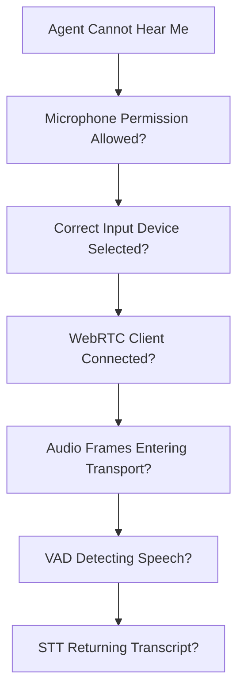

> [!tip]  
> Do not begin by rewriting the system prompt. First verify that audio reaches STT.


## I Cannot Hear the Agent

Use this order:

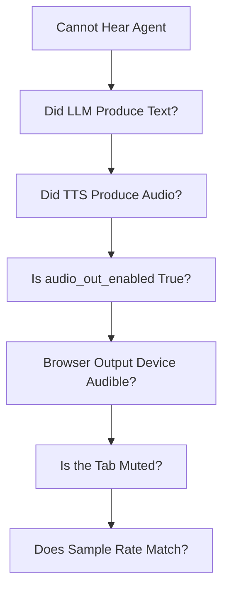

# Relevant Pipecat Code

## Transport Declaration

```python
TRANSPORT_PARAMS = {
    "webrtc": lambda: TransportParams(
        audio_in_enabled=True,
        audio_out_enabled=True,
    )
}
```


## Transport Creation

```python
transport = await create_transport(
    runner_args,
    TRANSPORT_PARAMS,
)
```

## Pipeline Boundaries

```python
transport.input()
...
transport.output()
```

## Development Runner

```python
if __name__ == "__main__":
    validate_startup_configuration()

    from pipecat.runner.run import main

    main()
```

# Common Mistakes

## Calling WebRTC an AI Model

WebRTC transports media.

It does not understand speech, grammar, or meaning.
## Debugging Connection Failures as Prompt Failures

If the agent cannot hear you, first verify:

```text
microphone → WebRTC → transport → STT
```
## Forgetting Browser Permission State

A previously denied permission may remain blocked until changed in browser settings.

## Testing With Loud Speakers

Echo can make the agent transcribe itself.

Use headphones during development.

## Exposing the Development Runner as Production Infrastructure

The built-in runner is excellent for local development.

Production needs:

- Authentication
    
- Deployment planning
    
- Scaling
    
- Monitoring
    
- Secure networking

## Assuming Every Transport Uses the Same Audio Format

Telephony and browser media may use different:

- Sample rates
    
- Codecs
    
- Encodings
    
- Channel layouts
    

# Key Takeaways

> [!summary]
> 
> - A transport connects the Pipecat pipeline to users.
>     
> - WebRTC is a low-latency browser media technology.
>     
> - The local runner supplies a ready-made development client.
>     
> - `transport.input()` receives audio.
>     
> - `transport.output()` sends audio.
>     
> - Connection events start and stop application behavior.
>     
> - Microphone permissions and echo are common non-AI failure points.
>     
> - Transport logic can change while the STT → LLM → TTS pipeline remains similar.
>