> [!info]  
> This chapter walks through the complete project lifecycle from startup to shutdown. The goal is to connect all previous concepts—configuration, prompts, transports, context, STT, LLM, TTS, and pipelines—to the actual implementation.


# Project Architecture Overview

The application is organized into four layers:

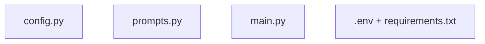

Each layer has a distinct responsibility:

|Layer|Responsibility|
|---|---|
|Configuration|Runtime settings and model selection|
|Behavior|Teaching personality and conversation rules|
|Pipeline|Runtime architecture|
|Environment|Secrets and dependencies|

# Runtime Lifecycle

At runtime, the application follows this sequence:

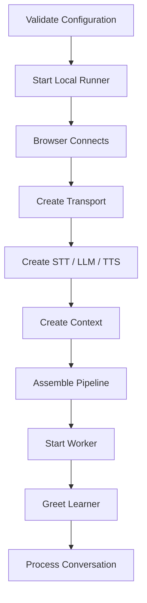

# Why This Chapter Matters

After reading this chapter, you should be able to answer:

- Where is the API key loaded?
    
- Where is the coach personality defined?
    
- Where are models selected?
    
- Where does audio enter?
    
- Where is memory stored?
    
- What starts the greeting?
    
- What ends the session?
    

If you can answer those questions, the code is no longer a black box.

# Step 1 — Install Required Capabilities

The project dependencies are defined in:

```text
requirements.txt
```

Key packages:

```text
pipecat-ai[openai,runner,silero,webrtc]==1.4.0
python-dotenv>=1.0.0,<2.0.0
```

## Why These Extras?

|Extra|Purpose|
|---|---|
|openai|STT, LLM, and TTS integrations|
|runner|Local development server|
|silero|Voice activity detection|
|webrtc|Browser audio transport|

> [!tip]  
> Pinning the Pipecat version protects the tutorial from future API changes.

# Step 2 — Define Environment Variables

`.env.example` documents required settings:

```dotenv
OPENAI_API_KEY=sk-your-openai-api-key-here

OPENAI_STT_MODEL=gpt-4o-transcribe
OPENAI_LLM_MODEL=gpt-4.1-mini
OPENAI_TTS_MODEL=gpt-4o-mini-tts

OPENAI_TTS_VOICE=coral
```

## Separation of Responsibilities

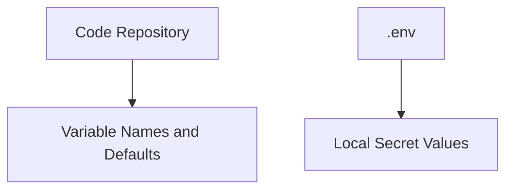

> [!warning]  
> The real `.env` file should never be committed to source control.


# Step 3 — Load and Validate Configuration

The project groups settings into a dataclass:

```python
@dataclass(frozen=True)
class AppConfig:
    openai_api_key: str
    stt_model: str
    llm_model: str
    tts_model: str
    tts_voice: str
```

## Why Use a Dataclass?

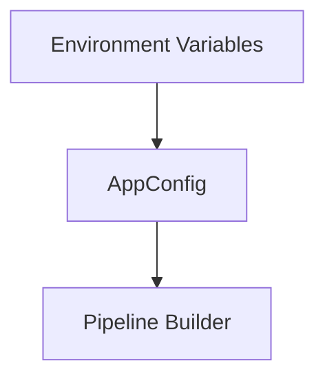

Instead of passing many unrelated strings around the application, everything is grouped into one configuration object.

## Early Validation

```python
api_key = os.getenv(
    "OPENAI_API_KEY",
    ""
).strip()

if not api_key:
    raise ConfigurationError(...)
```

Benefits:

- Fail fast
    
- Clear error messages
    
- Easier debugging
    

# Step 4 — Define the Coach Behavior

The teaching policy lives in:

```text
prompts.py
```

Core coaching procedure:

```text
1. Understand the learner
2. Correct important errors
3. Explain briefly
4. Respond naturally
5. Ask one follow-up question
```

## Voice-Specific Constraints

```text
two to four short sentences
no markdown
no emojis
no long lectures
do not invent mistakes
do not overclaim pronunciation analysis
```

These constraints matter because responses are spoken aloud.

## Prompt Architecture

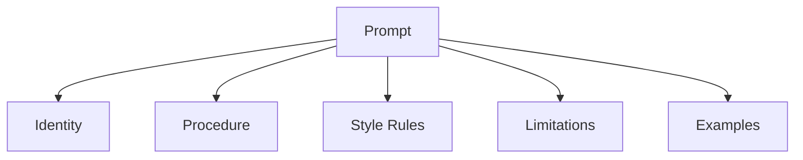

This structure is easier to maintain than one large paragraph.

# Step 5 — Define the Transport

The project uses WebRTC:

```python
TRANSPORT_PARAMS = {
    "webrtc": lambda: TransportParams(
        audio_in_enabled=True,
        audio_out_enabled=True,
    )
}
```

The agent requires two-way audio:

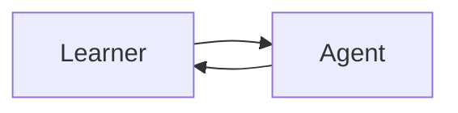

Video and telephony are intentionally excluded.
# Step 6 — Enter a Session

The Pipecat runner calls:

```python
async def bot(
    runner_args: RunnerArguments
) -> None:
    ...
```

Implementation:

```python
config = AppConfig.from_env()

transport = await create_transport(
    runner_args,
    TRANSPORT_PARAMS,
)

await run_voice_coach(
    transport,
    runner_args,
    config,
)
```

## Data Dependencies

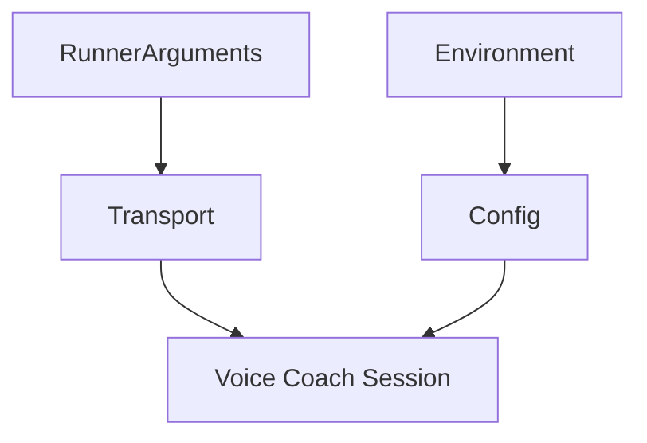

# Step 7 — Create STT

```python
stt = OpenAISTTService(...)
```

Purpose:

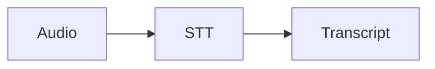

Educational design decision:

> Preserve learner mistakes instead of silently correcting them.

```text
I go yesterday to market.
```

must remain:

```text
I go yesterday to market.
```

not:

```text
I went to the market yesterday.
```

# Step 8 — Create the LLM

```python
llm = OpenAILLMService(...)
```

Responsibilities:

|Setting|Purpose|
|---|---|
|model|Select model|
|system_instruction|Define behavior|
|temperature|Control variation|
|max_completion_tokens|Limit response size|

## LLM Responsibilities

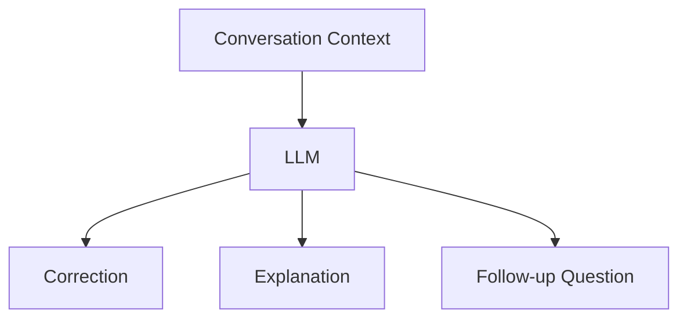

# Step 9 — Create TTS

```python
tts = OpenAITTSService(...)
```

Purpose:

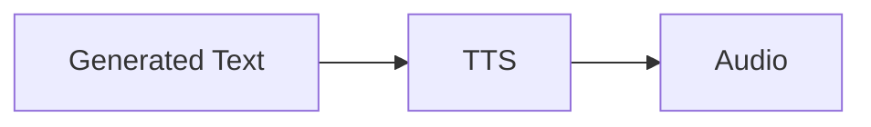
## Separation of Responsibilities

|Component|Responsibility|
|---|---|
|LLM|What to say|
|TTS|How it sounds|

Example TTS instruction:

```text
Speak like a patient, friendly English teacher.
```

This affects voice style but not teaching logic.

# Step 10 — Create Context and Turn Detection

```python
context = LLMContext()
```

```python
user_aggregator,
assistant_aggregator = ...
```

Combined responsibilities:

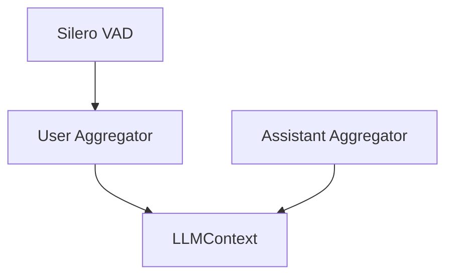

# Step 11 — Assemble the Pipeline

```python
pipeline = Pipeline(
    [
        transport.input(),
        stt,
        user_aggregator,
        llm,
        tts,
        transport.output(),
        assistant_aggregator,
    ]
)
```

Expanded view:

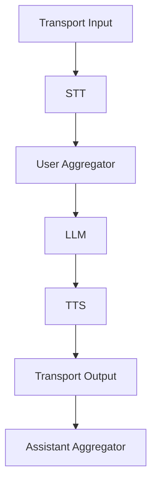
# Step 12 — Create the Worker

```python
worker = PipelineWorker(...)
```

Responsibilities:

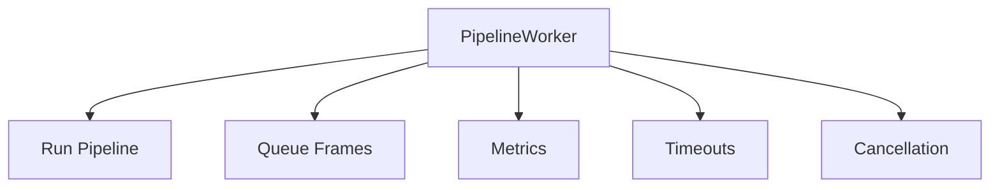

## Why These Settings?

|Setting|Purpose|
|---|---|
|24000 sample rate|Match OpenAI TTS|
|Metrics|Measure latency|
|Usage metrics|Measure consumption|
|Idle timeout|Stop abandoned sessions|

# Step 13 — Greet on Connection

Connection handler:

```python
@transport.event_handler(
    "on_client_connected"
)
```

Behavior:

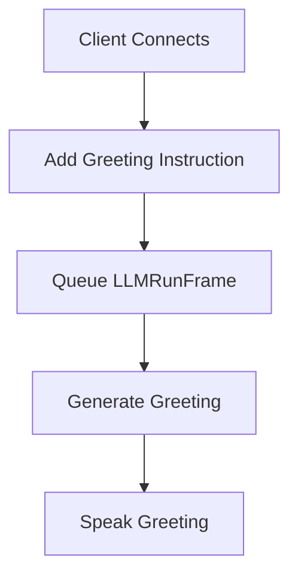

The greeting is generated dynamically by the LLM.

# Step 14 — Cancel on Disconnect

```python
@transport.event_handler(
    "on_client_disconnected"
)
```

Behavior:

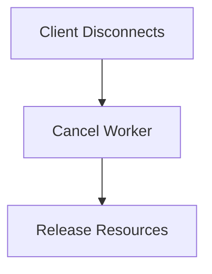

This is resource hygiene.

# Step 15 — Run the Worker

```python
runner = WorkerRunner(...)

await runner.add_workers(worker)

await runner.run()
```

At this point:

```text
The pipeline becomes active.
Frames begin flowing.
The voice agent is live.
```

# Step 16 — Start the Development Runner

```python
if __name__ == "__main__":
    validate_startup_configuration()

    from pipecat.runner.run import main

    main()
```

Startup sequence:

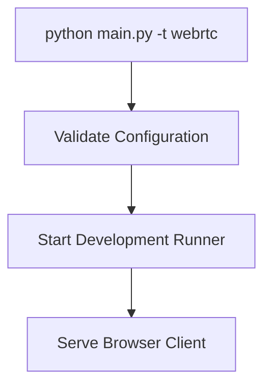


# Practical Modification — A2 Learner Mode

Modify the system prompt:

```text
Use common A2 vocabulary.
Ask questions with no more than twelve words.
Correct only one main mistake per turn.
```

Expected effect:

|Component|Changes?|
|---|---|
|Transport|❌|
|STT|❌|
|Memory|❌|
|TTS Voice|❌|
|LLM Behavior|✅|


# Practical Modification — Lesson Topic

Extend configuration:

```python
lesson_topic: str
```

Load it:

```python
lesson_topic=os.getenv(
    "LESSON_TOPIC",
    "daily life"
)
```

Add a developer message:

```python
context.add_message(...)
```

Flow:

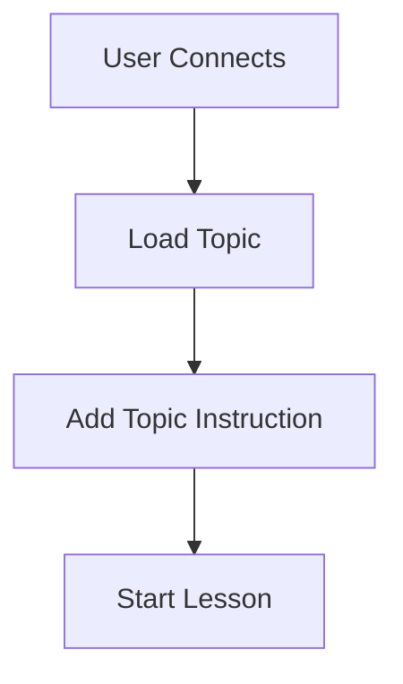

> [!tip]  
> Treat lesson topics as data, not as copies of the system prompt.

# Practical Modification — Fixed Greeting

Two approaches:

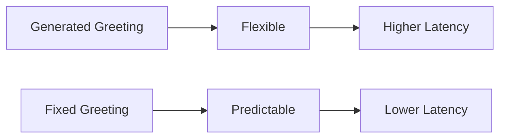

This is a product decision rather than a technical requirement.
# Relevant Pipecat Code

The session can be summarized in four operations:

```python
transport = await create_transport(...)
pipeline = Pipeline(...)
worker = PipelineWorker(...)
await runner.add_workers(worker)
```

Lifecycle integration:

```python
@transport.event_handler(...)
```

plus:

```python
await worker.queue_frames([
    LLMRunFrame()
])
```

These connect application behavior to session events.

# Common Mistakes

## Putting API Keys in Source Code

Use:

```text
.env (development)
Secret Manager (production)
```

## Editing main.py to Change Teaching Style

Behavior belongs in:

```text
prompts.py
```

## Hard-Coding Model Names Everywhere

Keep model selection centralized in configuration.
## Removing Aggregators

Without aggregators:

```text
No memory
No continuity
Weak conversations
```
## Starting the LLM Before Adding Context

Wrong:

```text
LLMRunFrame
↓
Greeting Instruction
```

Correct:

```text
Greeting Instruction
↓
LLMRunFrame
```

## Adding Complexity Before Validating the MVP

Always:

```text
Run baseline
↓
Add one feature
↓
Test
↓
Repeat
```

# Key Takeaways

> [!summary]
> 
> - The project separates environment, behavior, and pipeline structure.
>     
> - `bot()` is the session entry point.
>     
> - OpenAI services are processors inside the Pipecat pipeline.
>     
> - Context aggregators provide conversational continuity.
>     
> - Connection events start and stop session behavior.
>     
> - Configuration changes should not require pipeline rewrites.
>     
> - The codebase remains small because Pipecat handles orchestration details.
>     
> - Understanding this chapter means understanding the entire application lifecycle.
>