> [!info]  
> The current project is a teaching MVP. Production systems must handle real users, real costs, unreliable networks, security requirements, monitoring, and concurrent sessions.
# Concept Overview

The transition from MVP to production can be summarized as:

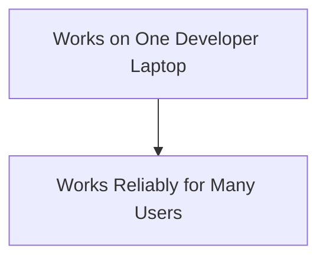

The goal is not to replace the existing pipeline.

The goal is to strengthen everything around it.

# What Production Actually Means

A demo can assume:

- One trusted user
    
- Valid API credentials
    
- Stable internet
    
- Quiet environment
    
- Manual recovery after failure
    

A production system cannot.

Production quality is:

```text
Correct Behavior
      +
Reliability
      +
Security
      +
Observability
      +
Cost Control
      +
Privacy
```

# Production Architecture

The MVP focuses on the voice pipeline:

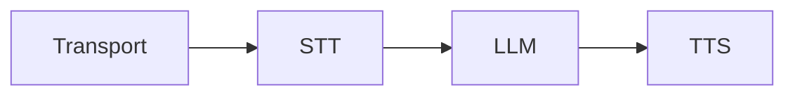

Production adds surrounding infrastructure:

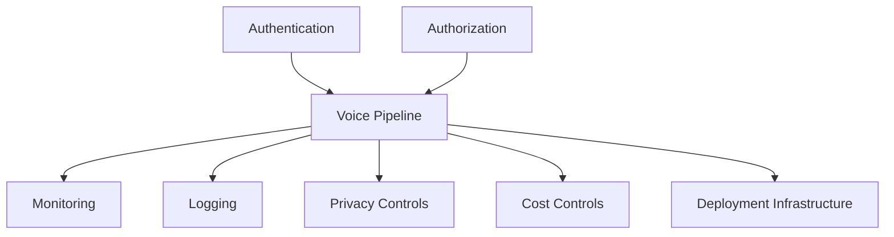
# Security and Secret Management

## Development

```text
.env
```

## Production

```text
Secret Manager
Platform Secrets
Vault
Cloud Secret Storage
```
## Security Rules

> [!warning]  
> Never send provider API keys to the browser.

Always:

- Keep secrets server-side
    
- Rotate exposed credentials
    
- Separate development and production keys
    
- Apply spending limits
    
- Restrict secret access
    

Architecture:

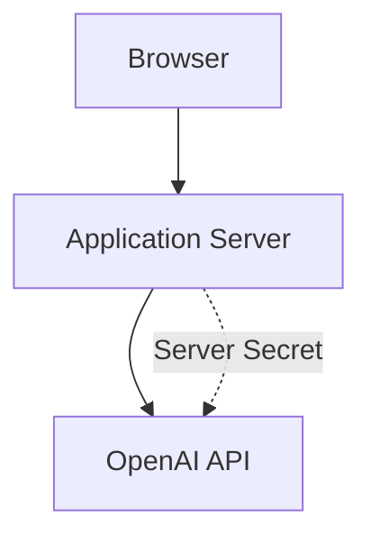

The browser should never directly possess provider credentials.
# Authentication and Authorization

The built-in `/client` page is intended for development.

A production learning platform should identify users.

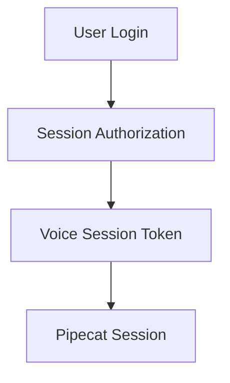
## Authorization Questions

Before creating a session, the system should know:

- Is the student allowed to start a session?
    
- Which course should be loaded?
    
- Which learner level applies?
    
- How long may the session run?
    
- May transcripts be stored?
    
- What permissions does the user have?
# Privacy and Consent

Voice applications process potentially sensitive data.

Production systems must explicitly define:

```text
What audio is transmitted?
What transcripts are stored?
How long are they retained?
Who can access them?
Can the learner delete them?
```

## Educational Application Guidelines

Recommended practices:

- Disclose AI-generated speech
    
- Explain use of external AI services
    
- Obtain recording consent where required
    
- Minimize stored personal information
    
- Avoid unnecessary audio retention
    
- Follow applicable regulations and policies
    

> [!important]  
> Do not treat LLM context as a hidden permanent student database.


# Error Handling by Stage

Handle failures where they occur.

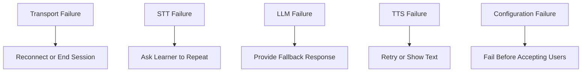

## Example Fallback

```python
FALLBACK_MESSAGE = (
    "Sorry, I had a technical problem. "
    "Please say your answer again."
)
```

> [!tip]  
> Never expose raw provider exceptions to learners.

# Timeouts and Retries

Every external service call can fail.

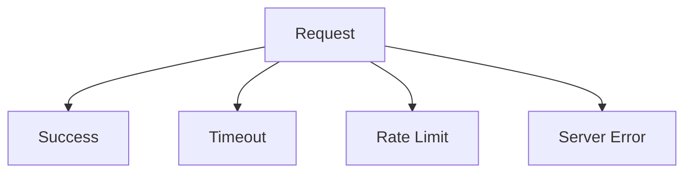


## Recommended Retry Strategy

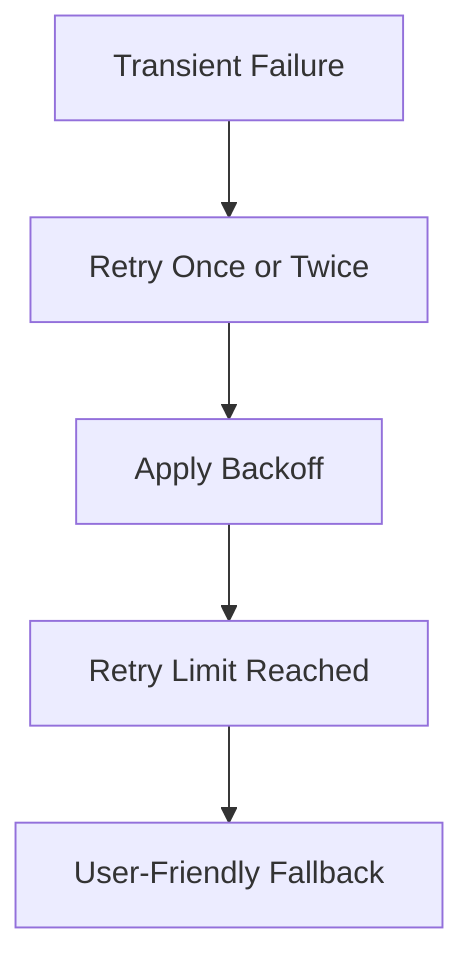

> [!warning]  
> Unlimited retries increase cost and can trap sessions indefinitely.
# Observability

Production systems should answer:

- Did the user connect?
    
- Was speech detected?
    
- Did STT succeed?
    
- How long did the LLM take?     
    
- Did TTS produce audio?
    
- Why did the session end?
    
- How much did the session cost?

## Existing MVP Metrics

```python
PipelineParams(
    enable_metrics=True,
    enable_usage_metrics=True,
)
```

## Production Observability Stack

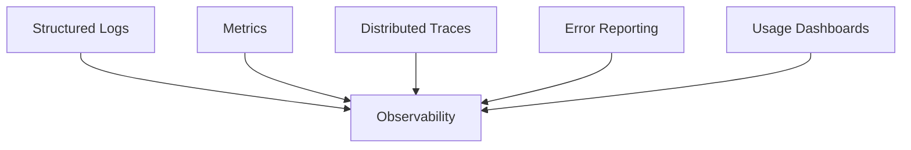

## Recommended Metrics

|Metric|Purpose|
|---|---|
|Connection Success Rate|Detect transport failures|
|STT Latency|Measure transcription speed|
|LLM Time to First Token|Measure thinking delay|
|TTS Time to First Audio|Measure speaking delay|
|Turn Latency|Measure user experience|
|Error Rate|Detect dependency failures|
|Token Usage|Control cost|
|Session Duration|Capacity planning|

# Logging Without Leaking Data

Bad:

```python
logger.info(
    f"API key: {config.openai_api_key}"
)
```

Bad by default:

```python
logger.info(
    f"Full transcript: {transcript}"
)
```

Better:

```python
logger.info(
    "STT completed",
    extra={
        "session_id": session_id,
        "latency_ms": latency_ms,
        "text_length": len(transcript),
    },
)
```
## Logging Principle

Log:

- Metadata
    
- Latency
    
- Usage
    
- Error codes
    

Avoid logging:

- Secrets
    
- Full personal conversations
    
- Sensitive user data
    

unless explicitly required and governed by policy.
# Cost Control

Every conversation turn may create:

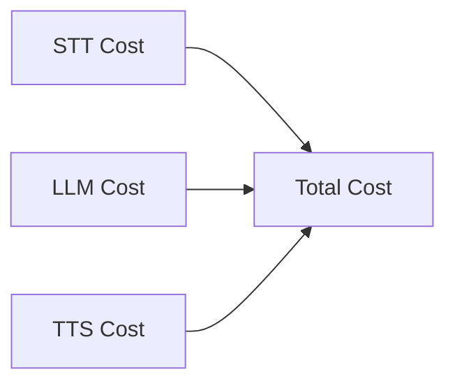

## Cost Reduction Strategies

- Keep responses short
    
- Limit session duration
    
- Summarize old context
    
- Detect idle sessions
    
- Apply user quotas
    
- Use appropriate models
    
- Monitor usage continuously
## Budget Formula

```text
Monthly Cost =
Active Learners
× Sessions per Learner
× Turns per Session
× Average Cost per Turn
```

> [!tip]  
> Measure real usage before estimating costs.

# Scaling

The MVP runs a single development session.

Production supports many concurrent learners.

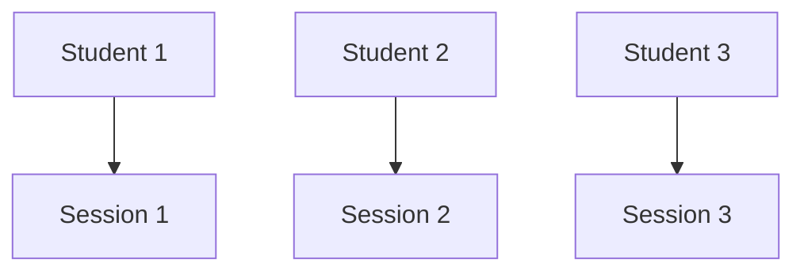

Each session requires:

- Transport connection
    
- Pipeline worker
    
- Context
    
- Provider requests
    
- CPU
    
- Memory
    
## Critical Rule

> [!danger]  
> Never share mutable conversation context between learners.

Every session must have isolated state.

# Session Lifecycle

Production lifecycle:

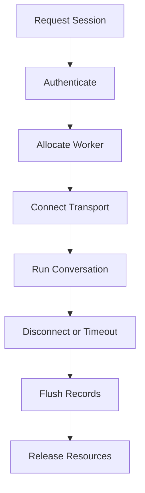

The MVP already demonstrates cleanup:

```python
await worker.cancel()
```

Production extends this to:

- Crashes
    
- Deployment shutdowns
    
- Unexpected disconnects
    
- Timeouts
# Audio Quality

Common issues:

```text
Echo
Noise
Low Volume
Clipping
Packet Loss
Wrong Sample Rate
Multiple Speakers
```

## Mitigation Strategies

|Problem|Solution|
|---|---|
|Echo|Headphones, echo cancellation|
|Noise|Noise suppression|
|Low Volume|Input level checks|
|Packet Loss|Reconnection handling|
|Long Pauses|Better VAD tuning|
|User Confusion|Clear UI states|

## UI States Matter

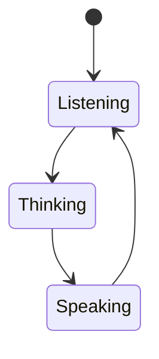

Showing these states greatly improves user experience.
# Prompt Safety and Educational Quality

The coach should:

- Avoid humiliating language
    
- Avoid pretending to be a certified evaluator
    
- Avoid inventing mistakes
    
- Respect learner level
    
- Respect lesson topic
    
- Follow product safety policies
## Prompt Evaluation Cases

Test prompts with:

```text
Correct sentence
Incorrect sentence
Very short answer
Long answer
Silence
Noise
Non-English answer
Off-topic request
Prompt injection attempt
```

# Testing Strategy

## Unit Tests

Test deterministic code.

Examples:

```text
Configuration loading
Missing key validation
Prompt generation
Learner-level mapping
Statistics logic
```

## Integration Tests

Test boundaries between components.

```text
Mock STT → Known Transcript
Mock LLM → Known Response
Mock TTS → Known Audio
```
## Conversation Evaluations

Example:

```yaml
learner: "I go yesterday to market."

expect:
  - correction uses "went"
  - mentions past tense
  - asks one question
  - tone is supportive
```

## Live Audio Testing

Test with:

- Multiple microphones
    
- Different accents
    
- Background noise
    
- Slow speakers
    
- Long pauses
    
- Interruptions
    

# Deployment Boundary

Keep session logic separate from infrastructure logic.

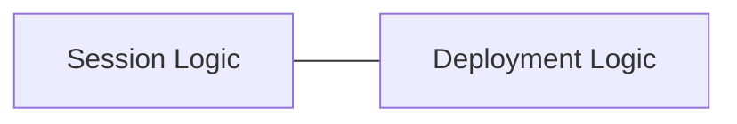

Examples:

|Session Logic|Deployment Logic|
|---|---|
|STT|Scaling|
|LLM|Load Balancing|
|TTS|Monitoring|
|Context|Authentication|

This separation simplifies migration to cloud infrastructure later.

--
# Production Readiness Checklist

```text
[ ] Secrets stored securely
[ ] User authentication
[ ] Session authorization
[ ] AI voice disclosure
[ ] Privacy policy
[ ] Retention policy
[ ] Provider timeouts
[ ] Bounded retries
[ ] User-friendly fallbacks
[ ] Structured logging
[ ] Latency metrics
[ ] Usage monitoring
[ ] Cost limits
[ ] Session cleanup
[ ] Context isolation
[ ] Prompt evaluations
[ ] Audio testing
[ ] Abuse prevention
```

# Relevant Pipecat Code

## Metrics

```python
PipelineParams(
    audio_out_sample_rate=24000,
    enable_metrics=True,
    enable_usage_metrics=True,
)
```

## Idle Control

```python
idle_timeout_secs=
    runner_args.pipeline_idle_timeout_secs
```

## Disconnect Cleanup

```python
@transport.event_handler(
    "on_client_disconnected"
)
async def on_client_disconnected(
    transport,
    client,
) -> None:
    await worker.cancel()
```

## Configuration Validation

```python
def validate_startup_configuration():
    try:
        AppConfig.from_env()
    except ConfigurationError as exc:
        logger.error(str(exc))
        raise SystemExit(1)
```

These are examples of production-minded design already present in the MVP.

# Common Mistakes

## Calling a Working Demo Production Ready

Production requires:

- Security
    
- Monitoring
    
- Reliability
    
- Operations
    
- Scaling
## Logging Secrets

Logs often have broad access and long retention periods.

## Retrying Forever

Infinite retries create:

- Higher cost
    
- Poor UX
    
- Stuck sessions
## Sharing Context Across Sessions

This risks leaking one learner's conversation to another.
## Optimizing Models While Ignoring Transport Failures

Measure the entire system, not just the LLM.

## Saving Audio Without Consent

Voice data requires explicit privacy decisions.

## Deploying Without Cost Controls

Voice applications generate many provider requests.

Costs can grow rapidly.

# Key Takeaways

> [!summary]
> 
> - Production quality includes reliability, privacy, security, cost control, and scalability.
>     
> - Secrets should remain server-side.
>     
> - Every learner session must have isolated state.
>     
> - Measure latency and usage at every stage.
>     
> - Use bounded retries and clear fallback responses.
>     
> - Store only the data you truly need.
>     
> - Test both conversation quality and real-world audio conditions.
>     
> - Preserve the simple session pipeline while strengthening the infrastructure around it.
>