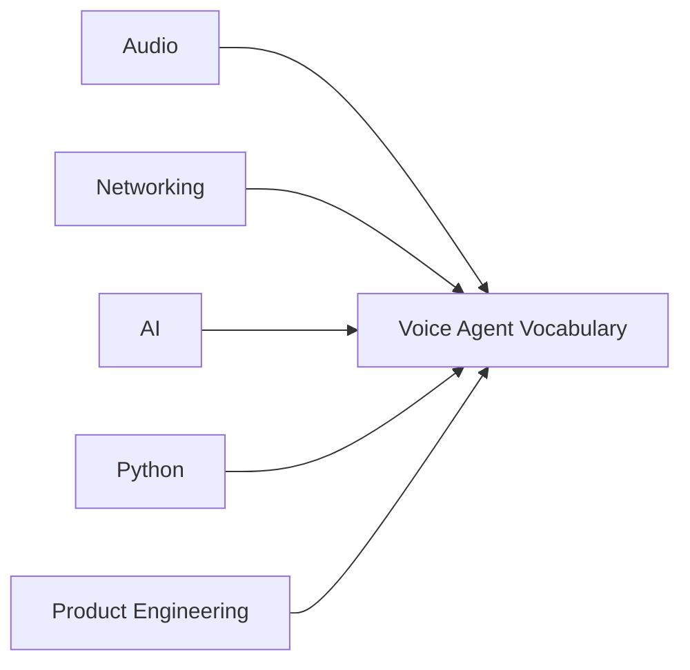
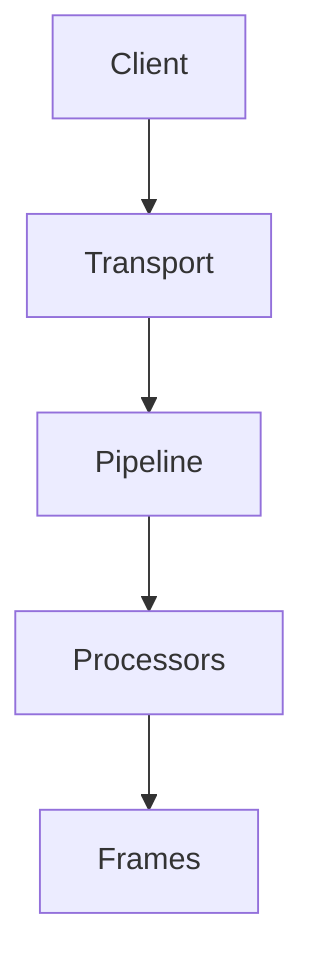
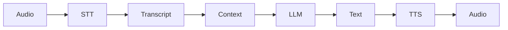
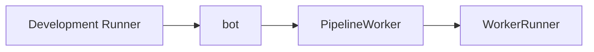
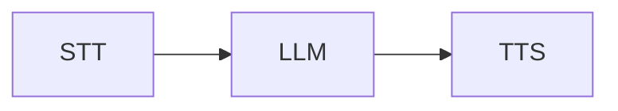
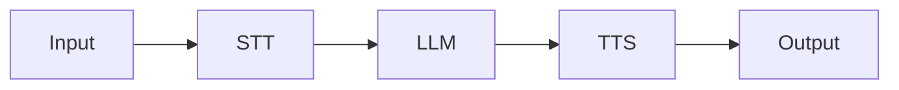
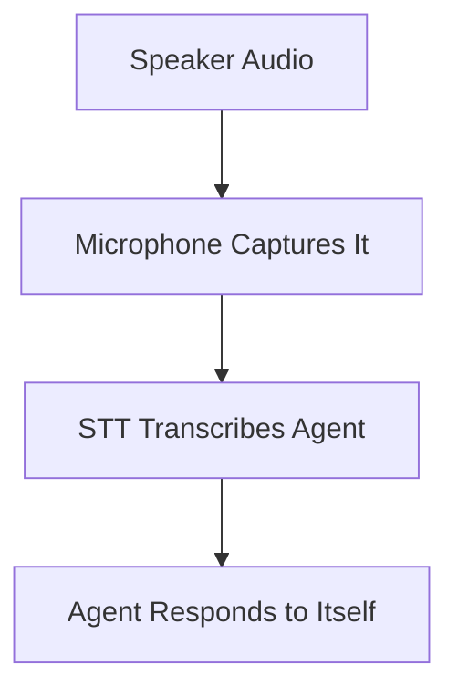
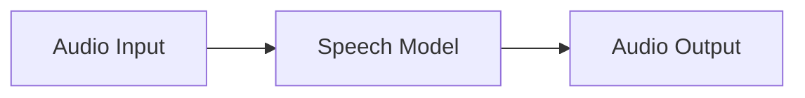

> [!info]  
> This glossary defines the most important terms used in the English Voice Coach project. The definitions are intentionally practical and connected to the code.
# Concept Overview

Voice-agent vocabulary combines several fields:



The same term may be used loosely in tutorials.

Use this glossary when reading the project code and report.

# Relationship Diagram



Main data path:



Runtime path:



# Core Terms

## Aggregator

A Pipecat processor that collects information and updates conversation context.

Project examples:

```python
user_aggregator
assistant_aggregator
```

|Aggregator|Responsibility|
|---|---|
|`user_aggregator`|Stores learner turns|
|`assistant_aggregator`|Stores coach turns|

## AI-Generated Voice

Speech synthesized by a model rather than recorded live by a human.

> [!important]  
> Applications should clearly disclose when users are hearing AI-generated speech.

## API

**Application Programming Interface.**

A defined way for one software system to request work from another.

In this project, OpenAI APIs are called through Pipecat service classes.


## API Key

A secret credential used to authenticate API requests.

```dotenv
OPENAI_API_KEY=...
```

Local development:

```text
.env
```

Production:

```text
Secret manager
```

> [!warning]  
> Never expose API keys in the browser or commit them to Git.

## Assistant Message

A conversation message representing the agent's response.

```json
{
  "role": "assistant",
  "content": "What did you buy there?"
}
```

## Asynchronous Python

A programming style using `async` and `await`.

It allows the application to handle network and streaming work without blocking everything else.

```python
async def bot(...):
    transport = await create_transport(...)
```

## Audio Frame

A frame carrying audio samples.

|Direction|Meaning|
|---|---|
|Input audio frame|Learner microphone audio|
|Output audio frame|Synthesized coach audio|

## Barge-In

When a user starts speaking while the agent is still speaking.

A production agent may:

- Stop TTS
    
- Listen to the new user turn
    
- Cancel the previous response
    
- Restart response generation
## Buffer

Temporary storage used to collect or smooth streaming data.

Buffers can improve continuity but may increase latency.

## Chained Architecture

A voice-agent design using separate stages:



Also called a **cascaded architecture**.
## Client

The user-facing application connected to the agent.

In this project, the client is Pipecat's local browser page.
## Context

The conversation history and instructions available to the LLM.

```python
context = LLMContext()
```

Context usually contains:

- System instruction
    
- Developer messages
    
- User turns
    
- Assistant turns
## Control Frame

A frame that triggers or controls behavior rather than carrying ordinary user content.

Example:

```python
LLMRunFrame()
```

Used to start the greeting.
## Data Frame

A frame carrying content such as:

- Audio
    
- Text
    
- Transcript
    
- Image
    
- Context
## Developer Message

An application-level instruction added to model context.

Project example:

```python
{
    "role": "developer",
    "content": START_CONVERSATION_PROMPT,
}
```

## Development Runner

Pipecat's local server utility.

It:

- Serves the local client
    
- Accepts connections
    
- Calls `bot(runner_args)`
## Downstream

The normal direction from transport input toward transport output.



## Echo

When speaker audio is captured again by the microphone.

Echo may cause the agent to transcribe its own voice.



## Event Handler

An async function called when a specific event occurs.

```python
@transport.event_handler("on_client_connected")
async def on_client_connected(...):
    ...
```

Common events:

- Client connected
    
- Client disconnected
## Frame

A typed unit of data or control moving through Pipecat processors.

> [!tip]  
> Frames are the things that flow through the pipeline.

## Frame Processor

A component that receives frames, performs work, and forwards or generates frames.

Examples:

- STT service
    
- LLM service
    
- TTS service
    
- Aggregator
    
- Logger
    
- Filter
## HTTP STT

Speech transcription performed through request/response HTTP calls.

The project uses VAD-segmented HTTP transcription.
## Idle Timeout

A time limit after which an inactive pipeline may be cancelled.

```python
idle_timeout_secs=runner_args.pipeline_idle_timeout_secs
```

## Jitter

Variation in network packet arrival timing.

Jitter buffering can smooth audio, but it may add latency.

## Latency

The delay between an action and its result.

Voice example:

```text
learner stops speaking → coach starts speaking
```

## LLM

**Large Language Model.**

It receives text/context and generates the coach's response.

```python
OpenAILLMService
```
## LLM Context

The structured messages available to the LLM for generating a response.

## LLMRunFrame

A control frame that tells the LLM to process the current context.

The project uses it to start the greeting.

```python
await worker.queue_frames([LLMRunFrame()])
```
## Long-Term Memory

Information preserved across sessions, usually in a database or memory system.

The MVP does not implement long-term memory.
## Metrics

Measurements of system behavior, such as:

- Latency
    
- Token usage
    
- Error rate
    
- Session duration
    

```python
enable_metrics=True
enable_usage_metrics=True
```
## Model

A trained AI system used for a task.

This project uses separate models for:

- Transcription
    
- Language generation
    
- Speech synthesis
    

## PCM

**Pulse-Code Modulation.**

A common representation of digital audio samples.

The OpenAI TTS integration produces 24 kHz PCM audio.

## Pipeline

An ordered set of Pipecat processors through which frames flow.

```python
Pipeline([
    transport.input(),
    stt,
    llm,
    tts,
    transport.output(),
])
```

> [!important]  
> Pipeline order is executable architecture.

## PipelineParams

Configuration for a running Pipecat pipeline.

Examples:

```python
PipelineParams(
    audio_out_sample_rate=24000,
    enable_metrics=True,
    enable_usage_metrics=True,
)
```

## PipelineWorker

The object that manages and executes one pipeline session.

It handles:

- Running the pipeline
    
- Queuing frames
    
- Metrics
    
- Timeout
    
- Cancellation
    

## Processor

See [[#Frame Processor]].

## Prompt

Instructions or messages that guide model behavior.

Project examples:

```python
ENGLISH_COACH_SYSTEM_PROMPT
START_CONVERSATION_PROMPT
```

## Realtime STT

Speech-to-text using a persistent streaming connection.

It can often provide:

- Interim transcripts
    
- Final transcripts
    
- Lower perceived latency
    

It is an alternative to HTTP STT.

## Response Streaming

Sending model output in pieces as it becomes available.

Instead of waiting for the full response, the system can begin processing early.
## Role

The type of a message in LLM context.

Common roles:

|Role|Meaning|
|---|---|
|`system`|Stable behavior|
|`developer`|Application instruction|
|`user`|Learner input|
|`assistant`|Coach output|

## RunnerArguments

Session information passed by the Pipecat development runner to:

```python
async def bot(runner_args: RunnerArguments)
```

It includes information needed to create the selected transport and manage the session.

## Sample Rate

The number of audio samples per second.

The project configures:

```python
audio_out_sample_rate=24000
```

Meaning:

```text
24,000 audio samples per second
```

## Session

One active conversation between a client and an agent pipeline.
## Short-Term Memory

Conversation context retained during the current session.

This is what the MVP uses.

## Silence Detection

The process of identifying when speech has stopped.

VAD helps with this, but turn completion may require additional logic.

## Speech-to-Speech

An architecture where a model processes audio and produces audio directly.



This differs from the chained STT → LLM → TTS architecture.

## STT

**Speech-to-Text.**

Converts learner audio into a transcript.

```python
OpenAISTTService
```

## System Instruction

High-priority stable guidance defining the model's role and behavior.

```python
system_instruction=ENGLISH_COACH_SYSTEM_PROMPT
```

## Temperature

A generation setting controlling variation.

|Temperature|Typical Behavior|
|---|---|
|Lower|More focused|
|Higher|More varied|

## Token

A unit of text processed by an LLM.

Both input context and generated output consume tokens.

## Transcript

Text predicted from speech audio by STT.

> [!warning]  
> A transcript is a model prediction, not guaranteed truth.

## Transport

A Pipecat component connecting the pipeline to an external client or media channel.

Examples:

- WebRTC browser transport
    
- Telephony transport
    
- Mobile app transport

## TTS

**Text-to-Speech.**

Converts the coach's generated text into audio.

```python
OpenAITTSService
```

## Turn

One participant's contribution to a conversation.

```text
learner turn → coach turn → learner turn
```
## Turn Detection

The process of deciding when a participant starts and finishes a turn.

This is essential because voice has no Enter key.
## Upstream

The direction opposite the normal content flow.

Used for:

- Control behavior
    
- Interruptions
    
- Feedback signals
    
- Cancellation
## User Message

A context message representing learner input.

```json
{
  "role": "user",
  "content": "I study computer science."
}
```

## VAD

**Voice Activity Detection.**

Estimates whether audio contains speech.

```python
SileroVADAnalyzer()
```

> [!note]  
> VAD detects speech activity. It does not understand sentence meaning.

## WebRTC

A real-time browser communication technology used to exchange audio and video.

This project uses WebRTC for:

- Microphone input
    
- Speaker output
## WorkerRunner

The Pipecat runner that manages one or more workers after they are configured.

```python
runner = WorkerRunner(...)

await runner.add_workers(worker)
await runner.run()
```

# Practical Examples

## Example 1 — Wrong Transcript

Problem:

```text
The transcript says "ship" but the learner said "sheep."
```

Likely layer:

```text
Audio / STT
```

Not:

```text
TTS
```
## Example 2 — Long Explanation

Problem:

```text
The transcript is correct, but the explanation is too long.
```

Likely layer:

```text
LLM prompt / settings
```

## Example 3 — No Sound

Problem:

```text
The response text is correct, but no sound plays.
```

Likely layer:

```text
TTS / transport / browser output
```
# Relevant Pipecat Code

```python
transport = await create_transport(
    runner_args,
    TRANSPORT_PARAMS,
)

context = LLMContext()

pipeline = Pipeline(
    [
        transport.input(),
        stt,
        user_aggregator,
        llm,
        tts,
        transport.output(),
        assistant_aggregator,
    ]
)

worker = PipelineWorker(
    pipeline,
    params=PipelineParams(...),
)
```

This small block contains most glossary terms in one place.

# Common Mistakes

- Using “model,” “processor,” and “pipeline” as synonyms
    
- Calling WebRTC the speech-recognition system
    
- Calling context permanent memory
    
- Assuming VAD understands sentence meaning
    
- Assuming the LLM receives raw audio in this chained project
    
- Confusing the development runner with `WorkerRunner`
    
- Treating a transcript as guaranteed ground truth
# Key Takeaways

> [!summary]
> 
> - Use precise vocabulary to locate failures and discuss architecture.
>     
> - Frames move through processors in a pipeline.
>     
> - Transports connect clients.
>     
> - Models perform AI transformations.
>     
> - Context is session conversation history.
>     
> - The chained path is audio → STT → LLM → TTS → audio.
>     
> - Refer back to this glossary while reading `main.py`.
>