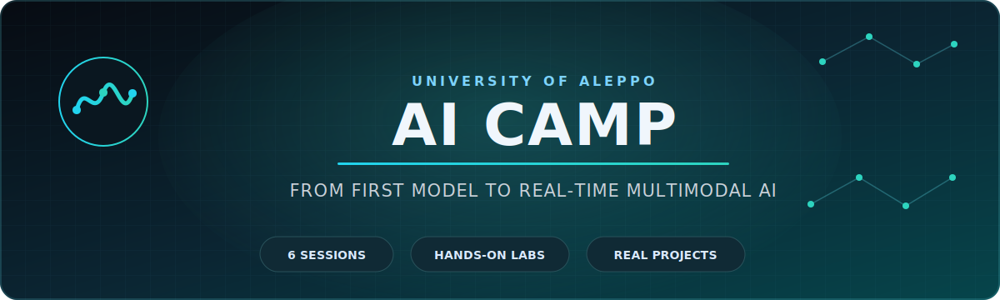
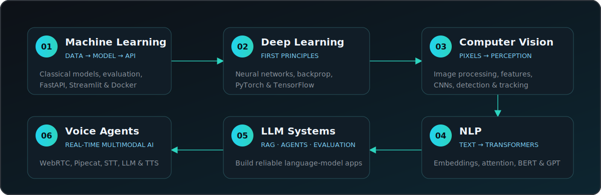
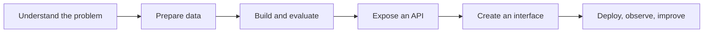

<div align="center">



# AI Camp — University of Aleppo

### Six sessions. One coherent journey. From your first model to real-time multimodal AI.

An open, hands-on AI curriculum built around **clear explanations, executable notebooks, real datasets, and end-to-end projects**.

[Explore the curriculum](#curriculum) · [Start learning](#quick-start) · [View the projects](#featured-builds) · [Join the community](https://t.me/AIworkshop_ite)

</div>

## Why this camp exists

AI is often taught as a collection of disconnected algorithms. This camp takes a different approach: every session builds on the previous one, and every major idea is connected to code, experiments, evaluation, and a useful application.

You begin with data and classical Machine Learning, learn how neural networks work from first principles, expand into vision and language, build modern LLM systems, and finish by connecting speech, reasoning, and vision inside real-time AI agents.

> **The goal is not to memorize six topics. The goal is to develop the engineering mindset required to turn AI concepts into working systems.**

## What makes it different

| Principle | How it appears in the camp |
|---|---|
| **Learn by building** | Each track contains notebooks, experiments, or an applied project—not slides alone. |
| **One connected journey** | The curriculum progresses from ML foundations to multimodal, real-time AI systems. |
| **Understand before abstracting** | Learners implement and inspect core ideas before relying on higher-level frameworks. |
| **Think beyond the model** | APIs, interfaces, evaluation, latency, safety, deployment, and production trade-offs are part of the learning path. |
| **Keep it reproducible** | Materials, datasets, code, setup instructions, and project structure live in one public repository. |

## Learning journey



## Curriculum

| Session | Track | Core topics | Applied outcome |
|:---:|---|---|---|
| **01** | [Machine Learning](./1-ML/) | Data cleaning, regression, classification, Random Forest, XGBoost, evaluation | [Employee Attrition Predictor](./1-ML/project/) with FastAPI, Streamlit, and Docker |
| **02** | [Deep Learning](./2-DL/) | Neural networks, forward propagation, backpropagation, optimization, PyTorch, TensorFlow | [Feed-Forward Neural Network from Scratch](./2-DL/Building-Neural-Network-from-Scratch/) and MNIST experiments |
| **03** | [Computer Vision](./3-CV/) | Image processing, filters, edges, SIFT, ORB, HOG, CNNs, detection, tracking | Day/night classification experiments and a real-time object-tracking workflow |
| **04** | [Natural Language Processing](./4-NLP/) | Preprocessing, tokenization, embeddings, RNNs, attention, Transformers, BERT, GPT | BERT-based Named Entity Recognition |
| **05** | [Large Language Models](./5-LLM/) | APIs, prompting, embeddings, vector search, RAG, LoRA/QLoRA, agents, memory, evaluation, safety | RAG, ReAct agent, extraction, generation, and automation labs |
| **06** | [Voice & Multimodal Agents](./6-voice_agent/) | Streaming, VAD, WebRTC, Pipecat, STT, LLMs, TTS, context, memory, production practices | Full-stack English Voice Coach and VisionTutor AI |

## Featured builds

<table>
<tr>
<td width="50%" valign="top">

### [Employee Attrition Predictor](./1-ML/project/)

An end-to-end ML product: data preparation, XGBoost training, evaluation, serialized artifacts, a FastAPI prediction service, a Streamlit interface, and Docker packaging.

`Machine Learning` `XGBoost` `FastAPI` `Streamlit` `Docker`

</td>
<td width="50%" valign="top">

### [Neural Network from Scratch](./2-DL/Building-Neural-Network-from-Scratch/)

A configurable feed-forward network implemented to make layers, activations, forward propagation, and learning mechanics visible before moving to deep-learning frameworks.

`Deep Learning` `Backpropagation` `NumPy` `First Principles`

</td>
</tr>
<tr>
<td width="50%" valign="top">

### [English Voice Coach](./6-voice_agent/English%20Voice%20Coach%20project/)

A full-stack educational voice agent that streams speech through WebRTC and Pipecat, then connects STT, an LLM coach, and TTS in a transparent real-time pipeline.

`Voice AI` `Pipecat` `WebRTC` `React` `FastAPI`

</td>
<td width="50%" valign="top">

### [VisionTutor AI](./6-voice_agent/VisionTutor%20project/)

A multimodal tutor that lets students point a camera at books, code, equations, documents, or diagrams, ask by voice, and receive a spoken explanation.

`Multimodal AI` `Vision LLM` `Voice Agent` `WebRTC` `React`

</td>
</tr>
</table>

## From notebook to AI product

Across the six sessions, learners repeatedly practice the complete engineering loop:



## What you will be able to do

By working through the repository, you will practice how to:

- frame an AI problem and prepare data for modeling;
- train and evaluate classical ML and deep-learning models;
- explain how CNNs, sequence models, attention, and Transformers connect;
- build semantic search, RAG, and tool-using LLM workflows;
- design real-time STT → LLM → TTS voice pipelines;
- connect a browser to Python AI services through FastAPI and WebRTC;
- reason about latency, safety, privacy, evaluation, and deployment—not accuracy alone;
- communicate a technical system through clean code, diagrams, and documentation.

## Who this repository is for

- University students building a serious foundation in applied AI
- Python developers moving into Machine Learning and Generative AI
- Self-learners who prefer notebooks and projects over isolated theory
- Instructors looking for a connected, practical AI teaching sequence
- Engineers who want to understand how modern AI components become full products

Basic Python familiarity is helpful. The sessions become progressively more advanced, so following them in order is recommended.

## Quick start

### 1. Clone the repository

```bash
git clone https://github.com/IbrahimAlobaid/AI-Camp.git
cd AI-Camp
```

### 2. Choose your path

- **New to AI:** begin with [`1-ML`](./1-ML/) and continue in order.
- **Comfortable with ML/DL:** start from [`3-CV`](./3-CV/) or [`4-NLP`](./4-NLP/).
- **Building GenAI systems:** explore [`5-LLM`](./5-LLM/) and [`6-voice_agent`](./6-voice_agent/).

### 3. Follow the session instructions

Open the selected folder and read its README when available. Most learning materials run as Jupyter notebooks locally or in Google Colab. Sessions with applications include their own environment and launch instructions.

Typical notebook setup with [`uv`](https://docs.astral.sh/uv/):

```bash
uv sync
uv run jupyter notebook
```

> Requirements vary by session. Use the README and project configuration inside the folder you are running instead of installing every dependency globally.

## Repository map

```text
AI-Camp/
├── 1-ML/               # Classical ML + end-to-end prediction product
├── 2-DL/               # Neural networks from scratch + framework practice
├── 3-CV/               # Image processing, CNNs, detection, and tracking
├── 4-NLP/              # Classical NLP through Transformers and BERT
├── 5-LLM/              # RAG, agents, adaptation, evaluation, and safety
├── 6-voice_agent/      # Pipecat, WebRTC, voice, and multimodal projects
├── assets/readme/      # Repository-owned visual assets
└── README.md
```

## Technology landscape

| Area | Technologies used across the camp |
|---|---|
| **ML & Data** | Python, NumPy, Pandas, scikit-learn, XGBoost |
| **Deep Learning & Vision** | PyTorch, TensorFlow/Keras, OpenCV, TorchVision |
| **NLP & LLMs** | Transformers, Sentence Transformers, embeddings, vector search, RAG, agents |
| **Backend & Real-time** | FastAPI, Pipecat, WebRTC, STT, TTS |
| **Product & Delivery** | Streamlit, React, Vite, Docker, Jupyter, Google Colab, `uv` |

## Community

This repository is part of a broader effort to make practical, high-quality AI education more accessible to students and developers in Syria.

- Join the [AI Workshop community on Telegram](https://t.me/AIworkshop_ite)
- Follow [Ibrahim Alobaid on GitHub](https://github.com/IbrahimAlobaid)
- Follow [Mohammad ghazal Kassas on GitHub](https://github.com/MohammadKassas143)
- Follow [Zayn-Mahrouseh on GitHub](https://github.com/Zayn-Mahrouseh)
- Connect on [LinkedIn](https://www.linkedin.com/in/ibrahimalobaid44/)
- Explore notebooks on [Kaggle](https://www.kaggle.com/ibrahimalobaid)

## Contributing

Corrections, clearer explanations, improved notebooks, reproducibility fixes, and additional learning exercises are welcome. Open an issue or submit a focused pull request describing what you changed and why it improves the learning experience.

---

<div align="center">

### Learn the foundations. Build the system. Share what you discover.

If this curriculum helps you, consider starring the repository and sharing it with another learner.

[Start with Session 1](./1-ML/) · [Explore LLM Systems](./5-LLM/) · [Build a Voice Agent](./6-voice_agent/)

</div>
